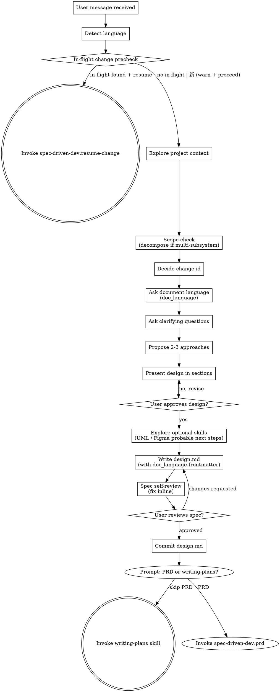

# Brainstorming Ideas Into Designs

Turn ideas into fully formed designs through natural collaborative dialogue, then hand off to writing-plans with a committed spec.

<HARD-GATE>
Do NOT invoke any implementation skill, write code, or scaffold files until design.md is approved by the user. This applies to EVERY project regardless of perceived simplicity.

**Language:** All user-facing replies in this skill MUST use the user's input language; internal template strings (file paths, code blocks, OpenSpec keywords) stay in English.

**Document language:** The body prose of design.md (and all downstream artifacts) MUST be written in the `doc_language` the user selects in step 5. If step 5 is skipped or the user does not answer, `doc_language` MUST default to the detected conversation language — NEVER default to English unless the conversation is in English. This is separate from the conversation reply language.
</HARD-GATE>

## Anti-Pattern: "This Is Too Simple To Need A Design"

Every project goes through this process. A todo list, a single-function utility, a config change — all of them. "Simple" projects are where unexamined assumptions cause the most wasted work. The design can be short, but you MUST present it and get approval.

## Checklist

You MUST create a task for each of these items and complete them in order:

1. **Detect language** — use the language of the user's first message; lock it for the whole conversation
1.5. **In-flight change precheck** — scan `openspec/changes/*/` for directories that have `design.md` but no `verification-report.md` (= in-flight).
   - If no in-flight change is found, proceed directly to step 2.
   - If any in-flight change is found, pause before step 2 and prompt the user verbatim: "偵測到 in-flight change `{change-id}`，要 resume 還是開新？".
     - On "resume" invoke `spec-driven-dev:resume-change`.
     - On "新" emit a warning that the in-flight change's progress is preserved but this session switches context, then proceed to step 2.
2. **Explore project context** — run `ls`, `git log -10`, read README and CLAUDE.md; detect if this is a frontend project via package.json / next.config / vite.config
3. **Scope check** — if the request includes multiple independent subsystems, help decompose first; brainstorm only the first sub-project through this session
4. **Decide change-id** — Propose a tentative change-id from the user's initial description (kebab-case verb+noun: `add-`, `refactor-`, `fix-`, `remove-`). Revise after clarifying questions if the scope or framing shifts.
5. **Ask document language** — ask which language the generated documents (design.md, tasks.md, proposal.md, etc.) should be written in. Present as multiple choice with the detected conversation language pre-selected as default:
   > "Which language should the generated documents be written in?"
   > 1. {detected conversation language} (same as our conversation) — **(default)**
   > 2. English
   > 3. 繁體中文 (Traditional Chinese)
   > 4. 简体中文 (Simplified Chinese)
   > 5. 日本語 (Japanese)
   > 6. Other (specify)

   Lock the chosen language as `doc_language` for all downstream document generation.
6. **Clarifying questions** — one at a time, multiple choice preferred; cover purpose / constraints / success criteria
7. **Propose 2-3 approaches** — with trade-offs; lead with the recommended option and reason
8. **Present design in sections** — architecture / components / data flow / error handling / testing; ask after each section
9. **Explore optional skills:**
   - "Does this change involve complex component interaction, state machines, or data flow?" — if yes, note for `spec-driven-dev:writing-uml`
   - "Is this a frontend UI change that needs visual designs?" — if yes, note for `spec-driven-dev:writing-figma`
   - Record outcomes in design.md as `## Probable next steps`
10. **Write design doc** to `openspec/changes/{change-id}/design.md` — create directories if needed. Include YAML frontmatter at the top:
    ```yaml
    ---
    change_id: {change-id}
    doc_language: {doc_language}
    ---
    ```
    Write all body prose in `doc_language`. File paths, code blocks, and OpenSpec keywords stay in English.
11. **Spec self-review** — placeholder scan / internal consistency / scope / ambiguity; fix inline, no re-review needed
12. **User review gate** — say verbatim: "Spec written to `{path}`. Please review and let me know if you want changes before we commit and move to writing-plans."
13. **Commit** — after user approval, stage and commit:
    ```
    git add openspec/changes/{change-id}/design.md
    git commit -m "docs: add design for {change-id}"
    ```
14. **Transition** — after user approves, ask:
    > "設計已完成。要先建立 PRD（`spec-driven-dev:prd`）再進入實作計畫，還是直接跳到 writing-plans？"
    > 1. 建立 PRD — invoke `spec-driven-dev:prd`
    > 2. 直接跳到 writing-plans — invoke `spec-driven-dev:writing-plans`

    Adapt the prompt language to the user's conversation language. Invoke only the `spec-driven-dev:*` version of the chosen skill (NOT the superpowers versions).

## Process Flow



The terminal state is invoking either `spec-driven-dev:prd` (optional) or `spec-driven-dev:writing-plans`. Do NOT invoke any other implementation skill from this skill.

## The Process

**Understanding the idea:**

- Check out the current project state first (files, docs, recent commits via `git log -10`)
- Before asking detailed questions, assess scope: if the request describes multiple independent subsystems (e.g., "build a platform with chat, file storage, billing, and analytics"), flag this immediately. Don't refine details of a project that needs decomposition first.
- If the project is too large for a single spec, help the user decompose into sub-projects: what are the independent pieces, how do they relate, what order to build? Then brainstorm the first sub-project through the normal design flow. Each sub-project gets its own spec → plan → implementation cycle.
- For appropriately-scoped projects, ask one question at a time to refine the idea
- Prefer multiple choice questions when possible, but open-ended is fine too
- Focus on understanding: purpose, constraints, success criteria

**Exploring approaches:**

- Propose 2-3 different approaches with trade-offs
- Lead with the recommended option and explain why
- Present options conversationally — not as a formal list of pros/cons

**Presenting the design:**

- Once you understand what is being built, present the design in sections
- Scale each section to its complexity: a few sentences if straightforward, up to 200-300 words if nuanced
- Ask after each section whether it looks right so far
- Cover: architecture, components, data flow, error handling, testing
- Be ready to go back and clarify if something does not make sense

**Design for isolation and clarity:**

- Break the system into smaller units that each have one clear purpose, communicate through well-defined interfaces, and can be understood and tested independently
- For each unit, answer: what does it do, how do you use it, what does it depend on?
- Smaller, well-bounded units are easier to reason about and safer to edit
- When a file grows large, that is often a signal it is doing too much

**Working in existing codebases:**

- Explore the current structure before proposing changes. Follow existing patterns.
- Where existing code has problems that affect the work (a file that has grown too large, unclear boundaries, tangled responsibilities), include targeted improvements as part of the design.
- Do not propose unrelated refactoring. Stay focused on what serves the current goal.

## Spec Self-Review

After writing design.md, look at it with fresh eyes and apply these four checks. Fix any issues inline — no need to re-review after fixing.

1. **Placeholder scan:** Any "TBD", "TODO", incomplete sections, or vague requirements? Fix.
2. **Internal consistency:** Do any sections contradict each other? Does the architecture match the feature descriptions? Fix.
3. **Scope check:** Is this focused enough for one implementation plan, or does it need decomposition? Fix.
4. **Ambiguity check:** Could any requirement be interpreted two different ways? Pick one, make it explicit. Fix.

## Key Principles

- **One question at a time** — do not overwhelm with multiple questions
- **Multiple choice preferred** — easier to answer than open-ended when possible
- **YAGNI ruthlessly** — remove unnecessary features from all designs
- **Explore alternatives** — always propose 2-3 approaches before settling
- **Incremental validation** — present design section by section, get approval before moving on
- **Be flexible** — go back and clarify when something does not make sense

## Transition Handoff

After the user approves the spec, ask whether to build a PRD first or proceed directly to writing-plans:

- **PRD selected** → invoke `spec-driven-dev:prd` — produces `prd.md` then chains to writing-plans / writing-figma / writing-uml
- **Skip PRD** → invoke `spec-driven-dev:writing-plans` directly

Do NOT invoke `superpowers:writing-plans` or `superpowers:prd` — they are different skills with different downstream chains.
