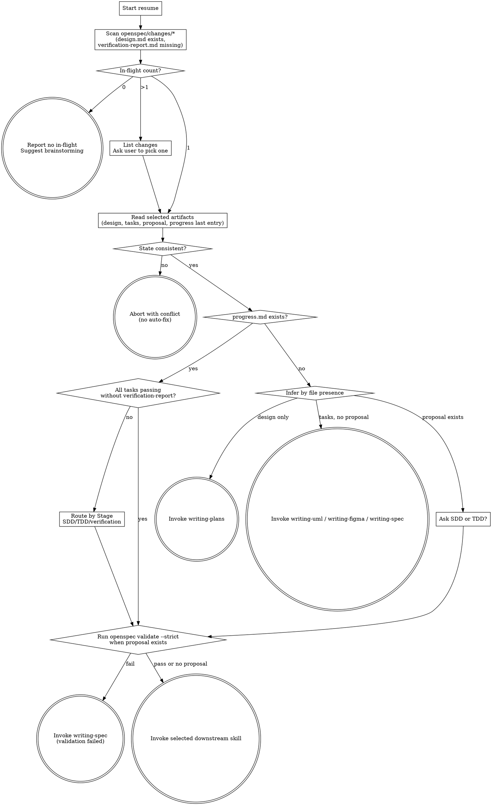

# Resume Spec-Driven Dev Work

Resume an interrupted OpenSpec change by detecting in-flight state, reading the last progress anchor, and invoking the correct next skill.

<HARD-GATE>
Do NOT auto-fix inconsistent state. `resume` reports conflicts and stops when the single-in-progress invariant is violated or when progress.md and tasks.md disagree.

**Language policy (read carefully — most output bugs come from violating this):**

- `conversation_language` = the language of design.md's frontmatter (when a change has been selected), or the user's first message. ALL user-facing prose (questions, prompts, transitions, error messages, abort messages) MUST be rendered in this language. Do NOT hardcode or copy any user-facing phrase from this SKILL file — every example sentence here is for your understanding only, not a string to echo.
- Stay in one language per surface. Do not mix Chinese characters with untranslated English nouns ("in-flight change", "resume", "task") unless that English token is a literal identifier (file path, code symbol, OpenSpec keyword, status enum like `in_progress`/`passing`/`blocked`, slash-command name like `/spec-driven-dev:brainstorming`). When in doubt, translate.
- File paths, code blocks, OpenSpec structural keywords, status enums, and slash-command names always stay in English regardless of `conversation_language`.
</HARD-GATE>

## Checklist

You MUST complete each item in order:

1. **Detect language** — set `conversation_language` from design.md frontmatter if a selected change exists, otherwise from the user's first message. Lock for the conversation.
2. **Scan in-flight changes** — list directories under `openspec/changes/*/` where `design.md` exists and `verification-report.md` does not.
3. **Route by in-flight count**:
   - If **0** in-flight changes exist, report — in `conversation_language` — that there is no in-flight change, suggest the user run `/spec-driven-dev:brainstorming` (keep the slash-command name verbatim), and stop. Do not invoke another skill.
   - If **1** in-flight change exists, select it and continue to step 4.
   - If **more than 1** exists, list each change-id with the last `- Next action:` line from `progress.md` (or a translated equivalent of `(no progress.md)` in `conversation_language` if absent), ask the user — in `conversation_language` — to pick one, then continue to step 4.
4. **Read selected change artifacts** — read `design.md`, `tasks.md` if present, `proposal.md` if present, and the last `## Session N` block from `progress.md` if present.
5. **Assert task state consistency**:
   - If tasks.md has more than one `status: in_progress`, report — in `conversation_language` — that the single-in-progress invariant has been violated, list the offending task ids inline, and tell the user to manually fix the state before retrying. Stop. Do NOT auto-fix. Keep the status enum names (`in_progress`, `blocked`, `not_started`) and task ids in English.
   - If progress.md last entry says `Transition: in_progress → passing` for task X but tasks.md task X still has `status: in_progress`, report — in `conversation_language` — the specific task id and stop. Do NOT auto-fix.
   - If progress.md is missing but tasks.md has exactly one `status: in_progress`, report — in `conversation_language` — that state is incomplete and route by file-presence inference only after warning that `progress.md` must be reconstructed by the chosen implementation skill.
6. **Route when progress.md exists** — print the last entry's `Next action` value, then route by `Stage` and task state:
   - `Stage: SDD` → invoke `spec-driven-dev:subagent-driven-development`.
   - `Stage: TDD` → invoke `spec-driven-dev:test-driven-development`.
   - `Stage: verification` → invoke `spec-driven-dev:verification-before-completion`.
   - If all tasks in tasks.md are `status: passing` but `verification-report.md` is missing, invoke `spec-driven-dev:verification-before-completion` regardless of the last implementation stage.
7. **Route when progress.md is missing** — infer from file presence:
   - `design.md` exists and `tasks.md` is missing → invoke `spec-driven-dev:writing-plans`.
   - `tasks.md` exists and `proposal.md` is missing → inspect `## Optional artifacts`; route to `spec-driven-dev:writing-uml` if PlantUML is checked, else `spec-driven-dev:writing-figma` if Figma is checked, else `spec-driven-dev:writing-spec`.
   - `proposal.md` exists and `progress.md` is missing → ask the user, in `conversation_language`, whether to proceed with SDD or TDD, then route to the selected implementation skill.
8. **Validate before handoff** — run `openspec validate {change-id} --strict` if `proposal.md` exists. If it fails, output the validation errors and invoke `spec-driven-dev:writing-spec` instead of implementation.

## Process Flow

## Error Handling

The table below describes situations and the required handling. The handling column describes the behaviour for you (the AI); when you actually surface a message to the user, render it in `conversation_language`.

| Situation | Handling |
|---|---|
| `progress.md` is missing but tasks.md already has a `status: in_progress` entry | Warn the user that state is incomplete; do not back-fill an old Session entry; require the downstream SDD/TDD skill to append a reconciliation Session entry (or block) on its first transition. |
| Multiple `status: in_progress` tasks | Report — in `conversation_language` — that the single-in-progress invariant is violated, list the offending task ids inline (e.g., `[task 1.2, task 2.1]`), and tell the user to fix manually before retrying. Do not auto-fix. |
| `design.md` exists but the current git branch does not match the branch convention for the change-id | Warn the user about the branch mismatch and ask them to confirm before continuing. |
| `openspec validate --strict` fails | Stop resuming, print the validation errors verbatim, and invoke `spec-driven-dev:writing-spec`. |
| An upstream skill's precheck has detected an in-flight change | Ask the user — in `conversation_language` — whether they want to resume the existing in-flight change `{change-id}` or start a new one. If they resume, hand off into this skill. If they start a new change, warn that the old change's progress is preserved. |
| When appending a Session entry you find the previous Session's transition ended at `in_progress` and this new entry is also `→ in_progress` | Warn that the previous session may have ended without recording its terminal state; let the downstream SDD/TDD skill append a reconciliation entry rather than rewriting history from inside `resume`. |

## Self-Review

Before handoff, confirm:

1. **Count check:** in-flight count branch was followed exactly.
2. **Invariant check:** no handoff occurred after multiple `status: in_progress` tasks.
3. **Routing check:** progress.md `Stage` or file-presence inference maps to exactly one downstream skill, except the explicit "SDD or TDD?" prompt.
4. **Evidence check:** the selected change-id, last `Next action`, and downstream skill are stated before invocation.
