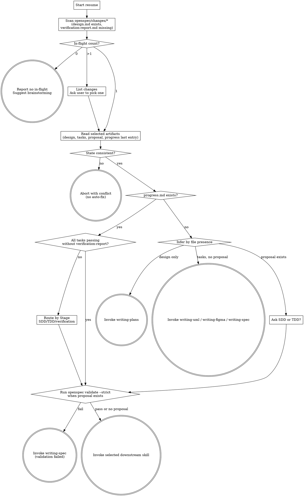

# Resume Spec-Driven Dev Work

Resume an interrupted OpenSpec change by detecting in-flight state, reading the last progress anchor, and invoking the correct next skill.

<HARD-GATE>
Do NOT auto-fix inconsistent state. `resume` reports conflicts and stops when the single-in-progress invariant is violated or when progress.md and tasks.md disagree.

**Language:** All user-facing replies in this skill MUST use the user's input language; internal template strings (file paths, commands, OpenSpec keywords) stay in English. Reuse the language detected in design.md frontmatter or the first user message.
</HARD-GATE>

## Checklist

You MUST complete each item in order:

1. **Detect language** — reuse from design.md frontmatter if a selected change exists, otherwise from the user's first message. Lock for the conversation.
2. **Scan in-flight changes** — list directories under `openspec/changes/*/` where `design.md` exists and `verification-report.md` does not.
3. **Route by in-flight count**:
   - If **0** in-flight changes exist, report "無 in-flight change", suggest `/spec-driven-dev:brainstorming`, and stop. Do not invoke another skill.
   - If **1** in-flight change exists, select it and continue to step 4.
   - If **more than 1** exists, list each change-id with the last `- Next action:` line from `progress.md` (or `(no progress.md)` if absent), ask the user to pick one, then continue to step 4.
4. **Read selected change artifacts** — read `design.md`, `tasks.md` if present, `proposal.md` if present, and the last `## Session N` block from `progress.md` if present.
5. **Assert task state consistency**:
   - If tasks.md has more than one `status: in_progress`, report: "違反 single-in-progress 不變式：[{task ids}]，請手動修正後重試". Stop. Do NOT auto-fix.
   - If progress.md last entry says `Transition: in_progress → passing` for task X but tasks.md task X still has `status: in_progress`, report the specific task and stop. Do NOT auto-fix.
   - If progress.md is missing but tasks.md has exactly one `status: in_progress`, report that state is incomplete and route by file-presence inference only after warning that `progress.md` must be reconstructed by the chosen implementation skill.
6. **Route when progress.md exists** — print the last entry's `Next action` value, then route by `Stage` and task state:
   - `Stage: SDD` → invoke `spec-driven-dev:subagent-driven-development`.
   - `Stage: TDD` → invoke `spec-driven-dev:test-driven-development`.
   - `Stage: verification` → invoke `spec-driven-dev:verification-before-completion`.
   - If all tasks in tasks.md are `status: passing` but `verification-report.md` is missing, invoke `spec-driven-dev:verification-before-completion` regardless of the last implementation stage.
7. **Route when progress.md is missing** — infer from file presence:
   - `design.md` exists and `tasks.md` is missing → invoke `spec-driven-dev:writing-plans`.
   - `tasks.md` exists and `proposal.md` is missing → inspect `## Optional artifacts`; route to `spec-driven-dev:writing-uml` if PlantUML is checked, else `spec-driven-dev:writing-figma` if Figma is checked, else `spec-driven-dev:writing-spec`.
   - `proposal.md` exists and `progress.md` is missing → ask the user "SDD or TDD?" and route to the selected implementation skill.
8. **Validate before handoff** — run `openspec validate {change-id} --strict` if `proposal.md` exists. If it fails, output the validation errors and invoke `spec-driven-dev:writing-spec` instead of implementation.

## Process Flow

## Error Handling

| 情境 | 處理 |
|---|---|
| `progress.md` 缺但 tasks.md 已有 `in_progress` | 警告 state 不完整；不要自行補寫舊 entry；要求接手的 SDD/TDD 在第一個 transition append 補記或阻塞。 |
| 多個 `in_progress` task | 報錯：「違反 single-in-progress 不變式：[task 1.2, task 2.1]，請手動修正後重試」，不自動修。 |
| `design.md` 存在但目前 git branch 不符合 change-id 對應分支 | 警告 branch mismatch，請使用者確認再繼續。 |
| `openspec validate --strict` 失敗 | resume 停手，輸出 validate errors，invoke `spec-driven-dev:writing-spec`。 |
| precheck 在上游 skill 偵測到 in-flight change | 反問「偵測到 in-flight change `{change-id}`，要 resume 還是開新？」；resume 會進入本 skill；開新會警告舊 change 進度保留。 |
| Session N entry 寫入時發現上一筆 transition 為 `in_progress` 但這次寫入也是 `→ in_progress` | 警告可能上一個 session 中斷未記錄結束狀態；由 SDD/TDD append 一筆補記，不在 resume 內自動改歷史。 |

## Self-Review

Before handoff, confirm:

1. **Count check:** in-flight count branch was followed exactly.
2. **Invariant check:** no handoff occurred after multiple `status: in_progress` tasks.
3. **Routing check:** progress.md `Stage` or file-presence inference maps to exactly one downstream skill, except the explicit "SDD or TDD?" prompt.
4. **Evidence check:** the selected change-id, last `Next action`, and downstream skill are stated before invocation.
