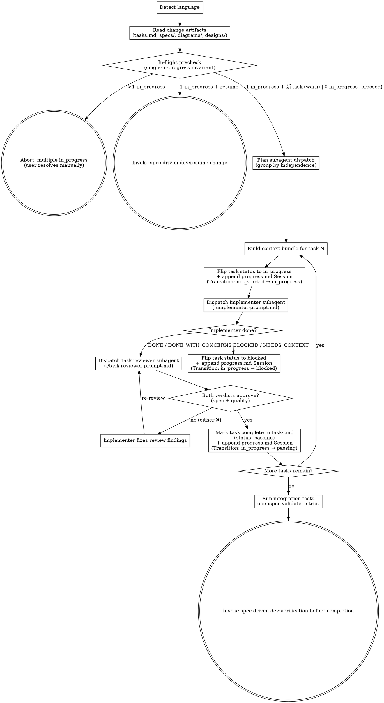

# Subagent-Driven Development

Execute approved OpenSpec tasks by dispatching one implementer subagent per task, followed by a mandatory task-reviewer subagent that returns both a spec-compliance and a code-quality verdict before marking any task complete.

<HARD-GATE>
Every task in tasks.md must receive a task-reviewer review with a combined verdict of `✅ APPROVE` (which requires BOTH the spec-compliance and the code-quality verdict to be ✅) before being marked complete. No partial credit; a combined verdict of `❌ CHANGES REQUESTED` sends the task back to the implementer.

**Language policy (read carefully — most output bugs come from violating this):**

- `conversation_language` = the language of proposal.md's frontmatter, or the user's first message if no frontmatter is present. ALL user-facing prose (questions, prompts, transitions, error messages, abort messages) MUST be rendered in this language. Do NOT hardcode or copy any user-facing phrase from this SKILL file — every example sentence here is for your understanding only, not a string to echo.
- Stay in one language per surface. Do not mix Chinese characters with untranslated English nouns ("in-flight task", "resume", "task") unless that English token is a literal identifier (file path, code symbol, OpenSpec keyword, status enum like `in_progress`/`passing`/`blocked`, dispatch outcome like `BLOCKED`/`NEEDS_CONTEXT`/`DONE`/`APPROVE`, slash-command name). When in doubt, translate.
- File paths, code blocks, OpenSpec structural keywords, status enums, subagent outcome tokens, and slash-command names always stay in English regardless of `conversation_language`.
</HARD-GATE>

> **Note:** This skill is parallel to `spec-driven-dev:test-driven-development` — user chooses one based on the change. Both read the same `openspec/changes/{change-id}/` artifacts. SDD favors multi-task parallelism with strict review gates; TDD favors red-green-refactor cycles per scenario.

## Checklist

You MUST complete each item in order:

1. **Detect language** — set `conversation_language` from proposal.md frontmatter or the first user message. Lock for the conversation.
2. **Read change artifacts** — read tasks.md in full; read each referenced `specs/{capability}/spec.md` in full; skim any `diagrams/*.puml` and `designs/figma.md` if present.
3. **In-flight precheck + single-in-progress assertion** — before dispatching any subagent:
   - Scan tasks.md for `- status: in_progress` sub-bullets. If **more than one** task has `status: in_progress`, abort and report the violation, in `conversation_language`: explain that tasks.md has multiple `in_progress` tasks, that the single-in-progress invariant has been violated, and that the user must manually resolve it (flip stale entries to `blocked` or `not_started`) before re-invoking SDD. Do NOT auto-fix. Keep the status enum names (`in_progress`, `blocked`, `not_started`) in English; only the surrounding prose is translated.
   - If **exactly one** task has `status: in_progress`, ask the user — phrased naturally in `conversation_language` — whether they want to resume the existing in-flight task `{task-id}` or start a different task. Render the literal `{task-id}` value inline; do not translate the identifier.
     - If the user chooses to resume, invoke `spec-driven-dev:resume-change` and stop this run.
     - If the user chooses to start a different task, warn (in `conversation_language`) that the in-flight task remains `in_progress` in tasks.md (preserved, not erased) and ask which task id to start instead, then proceed to step 4 with that task as the dispatch target.
   - If **no** task has `status: in_progress`, proceed silently to step 4.
4. **Plan subagent dispatch** — from tasks.md, group tasks by independence:
   - `independent` / `parallel-safe` tasks can each run as a separate implementer subagent (but only ONE subagent in flight at a time per SDD discipline — fresh context per task)
   - `serial` tasks dispatch in dependency order
   - Map each task to its referenced spec requirement via the `### Requirement: ...` heading match in spec.md
5. **Build subagent context bundle** for each task. The bundle MUST include:
   - Task description (verbatim from the tasks.md item N.M)
   - Acceptance criteria (the `#### Scenario: ...` WHEN/THEN/AND blocks from the relevant spec.md)
   - Referenced spec requirement excerpt (the full `### Requirement: ...` block)
   - Global Constraints: verbatim copy of the `## Global Constraints` section from tasks.md, if present
   - Interfaces: the task's `- Interfaces:` sub-bullet from tasks.md, if present
   - Referenced diagrams: for each `> See: ...` pointing to a `.puml` file, embed the FULL `.puml` content in the bundle (do not just pass the path)
   - Referenced design section: for each `> See: ../../designs/figma.md#...`, embed the figma.md section text plus the local screenshot path(s)
6. **Two-stage review loop** per task:
   a. **Implementer subagent** — before dispatching: (i) flip the target task's `- status:` line in tasks.md from `not_started` (or `blocked`, on resume) to `in_progress`, and (ii) append a Session entry to `openspec/changes/{change-id}/progress.md` with `Stage: SDD`, the task id, `Transition: not_started → in_progress` (or `blocked → in_progress` on resume), and a `Next action` line describing what the implementer will do. Then dispatch the subagent with the context bundle + `./implementer-prompt.md`; the subagent writes code, tests, and commits. See the *progress.md Session entry template* below for the exact format.
   b. **Task reviewer subagent** — dispatch with `./task-reviewer-prompt.md`; in one read-only pass it returns a spec-compliance verdict (code matches scenarios, diagrams, and designs) AND a code-quality verdict (craft and maintainability), plus a combined verdict line; if the combined verdict is `❌ CHANGES REQUESTED` → implementer subagent fixes the listed items → re-review
   c. **Mark task complete** — ONLY when the task-reviewer returns a combined verdict of `✅ APPROVE`: (i) flip the task's `- status:` line in tasks.md from `in_progress` to `passing` and check the `- [x]` box, and (ii) append a Session entry to `openspec/changes/{change-id}/progress.md` with `Stage: SDD`, the task id, `Transition: in_progress → passing`, an `Evidence` block listing the implementer commit hash(es) plus the task-reviewer outcome (`✅ APPROVE` = spec-compliance ✅ + code-quality ✅), and a `Next action` line pointing at the next task id (or `verification-before-completion` if this is the last task).
   d. **BLOCKED path** — if the implementer returns `BLOCKED` (or `NEEDS_CONTEXT` that cannot be resolved in this session): (i) flip the task's `- status:` line in tasks.md from `in_progress` to `blocked`, and (ii) append a Session entry to `openspec/changes/{change-id}/progress.md` with `Stage: SDD`, the task id, `Transition: in_progress → blocked`, the verbatim blocker description from the implementer report under `Blockers:`, and a `Next action` line describing what is needed to unblock (e.g. "fetch missing API contract from upstream team", "user decides between approach A/B"). Stop the loop; do NOT advance to the task-reviewer for a blocked task.
7. **Final pass** after all tasks complete:
   - Run any cross-task integration tests
   - Confirm tasks.md has all items checked and every task carries `status: passing`
   - Run `openspec validate {change-id} --strict`
8. **Transition** — invoke `spec-driven-dev:verification-before-completion`.

## Process Flow



## Subagent Context Bundle Template

Populate this template for each task before dispatching the implementer subagent.

```
## Task: {task-id from tasks.md, e.g. "1.2"}
{Task description, verbatim from tasks.md}

## Acceptance Criteria
{Verbatim copy of the relevant #### Scenario: blocks from spec.md, WHEN/THEN/AND}

## Referenced Spec Requirement
{Verbatim copy of the ### Requirement: ... block from spec.md}

## Global Constraints
{Verbatim copy of the ## Global Constraints section from tasks.md, if present}

## Interfaces
{The task's - Interfaces: sub-bullet from tasks.md, if present}

## Referenced Diagrams
{For each diagram referenced via > See: ..., embed the full .puml content here}

## Referenced Design
{For each design section referenced via > See: designs/figma.md#..., embed the figma.md section text + local screenshot path}

## Working Directory
{repo path}

## Branch
{feat branch name}
```

## progress.md Session Entry Template

Every status transition driven by SDD MUST append one Session block to `openspec/changes/{change-id}/progress.md`. Use this exact schema (Session N is `max(existing Session numbers) + 1`, or 1 if none):

```markdown
## Session N — YYYY-MM-DD HH:mm
- Stage: SDD
- Task: {task-id} {title}
- Transition: {from_state} → {to_state}
- Evidence:
  - Commits: {hash} {subject}
  - Tests: {short output excerpt or path to log}
- Next action: {one sentence}
- Blockers: {if any}
```

Field rules:

- `Transition` MUST be one of `not_started → in_progress` (step 6.a dispatch), `blocked → in_progress` (step 6.a resume), `in_progress → passing` (step 6.c mark complete), or `in_progress → blocked` (step 6.d BLOCKED path). Any other transition is a state-machine violation per `writing-plans`.
- `Evidence` is required on `in_progress → passing` (commits + reviewer outcomes) and recommended on `in_progress → blocked` (commits made so far, if any).
- `Next action` MUST be a non-empty single sentence on every entry — the `verification-before-completion` Stage 2 gate fails the change if the last Session block has an empty `Next action`.
- `Blockers` is required on `in_progress → blocked` and omitted otherwise.

## Prompt Templates

- `./implementer-prompt.md` — dispatch implementer subagent with context bundle
- `./task-reviewer-prompt.md` — dispatch the task reviewer after implementation; returns spec-compliance + code-quality verdicts in one read-only pass

## Self-Review

After completing all tasks, apply these four checks. Fix any issues inline.

1. **Coverage check:** Every tasks.md item is marked complete? Every task's task-reviewer returned a combined verdict of `✅ APPROVE`?
2. **Consistency check:** Do committed changes match the scenarios and diagrams specified in spec.md?
3. **Scope check:** Were any features added beyond what the spec requires? Flag and remove.
4. **Validation check:** Did `openspec validate {change-id} --strict` exit 0?

## Transition Handoff

After the final pass succeeds, invoke `spec-driven-dev:verification-before-completion`.

Invoke only `spec-driven-dev:*` versions via Skill tool. Do NOT invoke `superpowers:subagent-driven-development` — it is a different skill without OpenSpec context and does not integrate with the spec-driven-dev pipeline.
