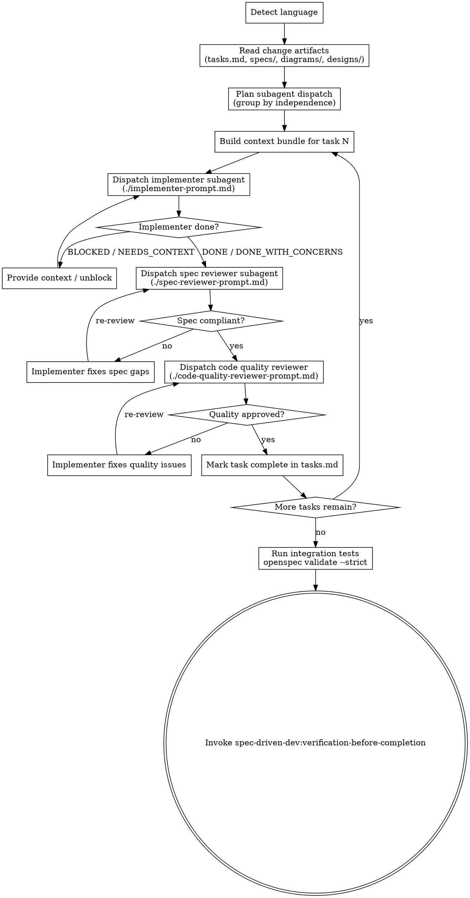

# Subagent-Driven Development

Execute approved OpenSpec tasks by dispatching one implementer subagent per task, followed by mandatory spec-reviewer and code-quality-reviewer subagents before marking any task complete.

<HARD-GATE>
Every task in tasks.md must pass BOTH spec-reviewer AND code-quality-reviewer before being marked complete. No partial credit; both reviewers must explicitly approve.

**Language:** All user-facing replies in this skill MUST use the user's input language; internal template strings (file paths, code blocks, OpenSpec keywords) stay in English. Reuse the language detected in proposal.md frontmatter or the first user message.
</HARD-GATE>

> **Note:** This skill is parallel to `spec-driven-dev:test-driven-development` — user chooses one based on the change. Both read the same `openspec/changes/{change-id}/` artifacts. SDD favors multi-task parallelism with strict review gates; TDD favors red-green-refactor cycles per scenario.

## Checklist

You MUST complete each item in order:

1. **Detect language** — reuse from proposal.md frontmatter or the first user message. Lock for the conversation.
2. **Read change artifacts** — read tasks.md in full; read each referenced `specs/{capability}/spec.md` in full; skim any `diagrams/*.puml` and `designs/figma.md` if present.
3. **Plan subagent dispatch** — from tasks.md, group tasks by independence:
   - `independent` / `parallel-safe` tasks can each run as a separate implementer subagent (but only ONE subagent in flight at a time per SDD discipline — fresh context per task)
   - `serial` tasks dispatch in dependency order
   - Map each task to its referenced spec requirement via the `### Requirement: ...` heading match in spec.md
4. **Build subagent context bundle** for each task. The bundle MUST include:
   - Task description (verbatim from the tasks.md item N.M)
   - Acceptance criteria (the `#### Scenario: ...` WHEN/THEN/AND blocks from the relevant spec.md)
   - Referenced spec requirement excerpt (the full `### Requirement: ...` block)
   - Referenced diagrams: for each `> See: ...` pointing to a `.puml` file, embed the FULL `.puml` content in the bundle (do not just pass the path)
   - Referenced design section: for each `> See: ../../designs/figma.md#...`, embed the figma.md section text plus the local screenshot path(s)
5. **Three-stage review loop** per task:
   a. **Implementer subagent** — dispatch with context bundle + `./implementer-prompt.md`; subagent writes code, tests, and commits
   b. **Spec reviewer subagent** — dispatch with `./spec-reviewer-prompt.md`; verifies code matches scenarios, diagrams, and designs; if ❌ → implementer subagent fixes → re-review
   c. **Code quality reviewer subagent** — dispatch with `./code-quality-reviewer-prompt.md`; assesses craft and maintainability; if ❌ → implementer subagent fixes → re-review
   d. ONLY when both reviewers ✅ → mark the task complete in tasks.md
6. **Final pass** after all tasks complete:
   - Run any cross-task integration tests
   - Confirm tasks.md has all items checked
   - Run `openspec validate {change-id} --strict`
7. **Transition** — invoke `spec-driven-dev:verification-before-completion`.

## Process Flow



## Subagent Context Bundle Template

Populate this template for each task before dispatching the implementer subagent.

```
## Task: {task-id from tasks.md, e.g. "1.2"}
{Task description, verbatim from tasks.md}

## Acceptance Criteria
{Verbatim copy of the relevant #### Scenario: blocks from spec.md, WHEN/THEN/AND}

## Referenced Spec Requirement
{Verbatim copy of the ### Requirement: ... block from spec.md}

## Referenced Diagrams
{For each diagram referenced via > See: ..., embed the full .puml content here}

## Referenced Design
{For each design section referenced via > See: designs/figma.md#..., embed the figma.md section text + local screenshot path}

## Working Directory
{repo path}

## Branch
{feat branch name}
```

## Prompt Templates

- `./implementer-prompt.md` — dispatch implementer subagent with context bundle
- `./spec-reviewer-prompt.md` — dispatch spec compliance reviewer after implementation
- `./code-quality-reviewer-prompt.md` — dispatch code quality reviewer after spec passes

## Self-Review

After completing all tasks, apply these four checks. Fix any issues inline.

1. **Coverage check:** Every tasks.md item is marked complete? Every task had both reviewers approve?
2. **Consistency check:** Do committed changes match the scenarios and diagrams specified in spec.md?
3. **Scope check:** Were any features added beyond what the spec requires? Flag and remove.
4. **Validation check:** Did `openspec validate {change-id} --strict` exit 0?

## Transition Handoff

After the final pass succeeds, invoke `spec-driven-dev:verification-before-completion`.

Invoke only `spec-driven-dev:*` versions via Skill tool. Do NOT invoke `superpowers:subagent-driven-development` — it is a different skill without OpenSpec context and does not integrate with the spec-driven-dev pipeline.
