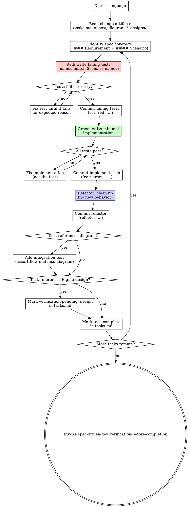

# Test-Driven Development

<HARD-GATE>
Each task must show a failing-test commit BEFORE any implementation commit. A task in tasks.md cannot be checked off without a green-test commit on record.

**Language:** All user-facing replies in this skill MUST use the user's input language; internal template strings (file paths, code blocks, OpenSpec keywords) stay in English. Reuse the language detected in proposal.md frontmatter or the first user message.
</HARD-GATE>

> **Note:** This skill is parallel to `spec-driven-dev:subagent-driven-development` — user chooses one. TDD favors red-green-refactor cycles per scenario with strict commit discipline; SDD favors multi-task subagent dispatch with two-stage review.

## Checklist

You MUST complete each item in order:

1. **Detect language** — reuse from proposal.md frontmatter or the first user message. Lock for the conversation.
2. **Read change artifacts** — read tasks.md in full; read each referenced `specs/{capability}/spec.md` in full; skim any `diagrams/*.puml` and `designs/figma.md` if present.
3. **For each task in tasks.md, follow the per-task TDD loop** (described in the next section).
4. **Update tasks.md** — check off each completed task after its green commit (and any refactor commit) are on record.
5. **Transition** — invoke `spec-driven-dev:verification-before-completion`.

## Per-Task TDD Loop

For each task, execute these steps in strict order:

1. **Identify spec coverage** — find the `### Requirement: ...` heading and all `#### Scenario:` blocks cited in this task. These are the acceptance criteria to implement against.
2. **Red** — write failing tests. Each test name MUST be derived from the corresponding `#### Scenario:` name. Example: scenario `Successful login` → test `test("Successful login", ...)` or `def test_successful_login()`.
3. **Run tests, verify they fail for the expected reason** — e.g., function not defined, expected output not matched. If the test passes immediately, the test is wrong; fix it.
4. **Commit the failing tests**: `git add tests/ && git commit -m "test: red - {scenario or task description}"`.
5. **Green** — write the minimum implementation to pass. Do not add features, refactor other code, or optimize beyond what the test requires.
6. **Run tests, verify all pass.**
7. **Commit the implementation**: `git add src/ && git commit -m "feat: green - {task description}"`.
8. **Refactor** — clean up names, extract helpers, remove duplication. Tests must still pass. Do not add behavior.
9. **Commit if refactor changed code**: `git add . && git commit -m "refactor: {what was cleaned}"`.
10. **Diagram/design coverage** (conditional):
    - If the task references a diagram via `> See: ../../diagrams/*.puml`: add an integration test asserting the runtime flow matches the diagram contract (message order for sequence; state transitions for state; schema for ER; etc.).
    - If the task references a Figma design via `> See: ../../designs/figma.md#...`: do NOT attempt visual assertions here. Mark the scenario in tasks.md as `verification-pending: design` and continue. `spec-driven-dev:verification-before-completion` handles visual diffs later.
11. **Mark task complete** in tasks.md only after the green commit + (any refactor commit) are on record.

## Process Flow

## TDD Discipline Rules

All of these are MUST:

- No implementation before a failing test exists in commit history.
- No skipping Red phase. Even "trivial" code needs a failing test first.
- Test name MUST match `#### Scenario:` name (use the exact text in test function/case names where the testing framework allows).
- One failing test → one minimal implementation → one refactor pass. Don't batch multiple scenarios into one cycle.
- Commit messages MUST encode the phase: `test:` (red), `feat:` (green), `refactor:` (refactor).

## Diagram → Integration Test Rule

If a scenario references a diagram, add an integration test that asserts the runtime flow matches the diagram's contract:
- Sequence: assert function/service call order
- State: assert valid transitions and forbidden transitions
- ER: assert schema migration produces expected entities/foreign keys
- Class: assert types/interfaces match (often a compile-time check, not runtime)

## Design → Deferred Verification Rule

If a scenario references a Figma design, do NOT attempt visual assertions in TDD. Mark the scenario as `verification-pending: design` in tasks.md (annotate the task line). Visual diffs are handled by `spec-driven-dev:verification-before-completion`.

## Self-Review

After completing all tasks, apply these four checks. Fix any issues inline.

1. **Coverage check:** Every tasks.md item is marked complete? Every task has a `test: red` commit preceding its `feat: green` commit?
2. **Consistency check:** Do test names match the `#### Scenario:` names from spec.md verbatim (or as close as the testing framework allows)?
3. **Scope check:** Were any features added beyond what the failing tests required? Flag and remove.
4. **Deferred check:** Are all Figma-referenced scenarios annotated `verification-pending: design`? Are diagram-referenced scenarios covered by integration tests?

## Transition Handoff

After all tasks are complete and the self-review passes, invoke `spec-driven-dev:verification-before-completion`.

Invoke only `spec-driven-dev:*` versions via Skill tool. Do NOT invoke `superpowers:test-driven-development` — it is a different skill without OpenSpec context and does not integrate with the spec-driven-dev pipeline.
