# Test-Driven Development

<HARD-GATE>
Each task must show a failing-test commit BEFORE any implementation commit. A task in tasks.md cannot be checked off without a green-test commit on record.

**Language policy (read carefully — most output bugs come from violating this):**

- `conversation_language` = the language of proposal.md's frontmatter, or the user's first message if no frontmatter is present. ALL user-facing prose (questions, prompts, transitions, error messages, abort messages) MUST be rendered in this language. Do NOT hardcode or copy any user-facing phrase from this SKILL file — every example sentence here is for your understanding only, not a string to echo.
- Stay in one language per surface. Do not mix Chinese characters with untranslated English nouns ("in-flight task", "resume", "task") unless that English token is a literal identifier (file path, code symbol, OpenSpec keyword, status enum like `in_progress`/`passing`/`blocked`, commit prefix like `test:`/`feat:`/`refactor:`, slash-command name). When in doubt, translate.
- File paths, code blocks, OpenSpec structural keywords, status enums, commit prefixes, and slash-command names always stay in English regardless of `conversation_language`.
</HARD-GATE>

> **Note:** This skill is parallel to `spec-driven-dev:subagent-driven-development` — user chooses one. TDD favors red-green-refactor cycles per scenario with strict commit discipline; SDD favors multi-task subagent dispatch with two-stage review.

## Checklist

You MUST complete each item in order:

1. **Detect language** — set `conversation_language` from proposal.md frontmatter or the first user message. Lock for the conversation.
2. **Read change artifacts** — read tasks.md in full; read each referenced `specs/{capability}/spec.md` in full; skim any `diagrams/*.puml` and `designs/figma.md` if present.
3. **In-flight precheck + single-in-progress assertion** — before entering any Red phase:
   - Scan tasks.md for `- status: in_progress` sub-bullets. If **more than one** task has `status: in_progress`, abort and report the violation, in `conversation_language`: explain that tasks.md has multiple `in_progress` tasks, that the single-in-progress invariant has been violated, and that the user must manually resolve it (flip stale entries to `blocked` or `not_started`) before re-invoking TDD. Do NOT auto-fix. Keep the status enum names (`in_progress`, `blocked`, `not_started`) in English; only the surrounding prose is translated.
   - If **exactly one** task has `status: in_progress`, ask the user — phrased naturally in `conversation_language` — whether they want to resume the existing in-flight task `{task-id}` or start a different task. Render the literal `{task-id}` value inline; do not translate the identifier.
     - If the user chooses to resume, invoke `spec-driven-dev:resume-change` and stop this run.
     - If the user chooses to start a different task, warn (in `conversation_language`) that the in-flight task remains `in_progress` in tasks.md (preserved, not erased) and ask which task id to start instead, then proceed to step 4 with that task as the TDD target.
   - If **no** task has `status: in_progress`, proceed silently to step 4.
4. **For each task in tasks.md, follow the per-task TDD loop** (described in the next section).
5. **Update tasks.md** — check off each completed task after its green commit (and any refactor commit) are on record, and ensure every completed task carries `status: passing`.
6. **Transition** — invoke `spec-driven-dev:verification-before-completion`.

## Per-Task TDD Loop

For each task, execute these steps in strict order:

0. **Start task transition** — before identifying spec coverage: (i) flip the target task's `- status:` line in tasks.md from `not_started` (or `blocked`, on resume) to `in_progress`, and (ii) append a Session entry to `openspec/changes/{change-id}/progress.md` with `Stage: TDD`, the task id, `Transition: not_started → in_progress` (or `blocked → in_progress` on resume), and a non-empty `Next action` line describing the Red phase to write next. See the *progress.md Session Entry Template* below.
1. **Identify spec coverage** — find the `### Requirement: ...` heading and all `#### Scenario:` blocks cited in this task. These are the acceptance criteria to implement against.
2. **Red** — write failing tests. Each test name MUST be derived from the corresponding `#### Scenario:` name. Example: scenario `Successful login` → test `test("Successful login", ...)` or `def test_successful_login()`.
3. **Run tests, verify they fail for the expected reason** — e.g., function not defined, expected output not matched. If the test passes immediately, the test is wrong; fix it.
4. **Commit the failing tests**: `git add tests/ && git commit -m "test: red - {scenario or task description}"`.
5. **Green** — write the minimum implementation to pass. Do not add features, refactor other code, or optimize beyond what the test requires.
6. **Run tests, verify all pass.**
7. **Commit the implementation**: `git add src/ && git commit -m "feat: green - {task description}"`.
8. **Refactor** — clean up names, extract helpers, remove duplication. Tests must still pass. Do not add behavior.
9. **Commit if refactor changed code**: `git add . && git commit -m "refactor: {what was cleaned}"`.
10. **Diagram/design coverage** (conditional):
    - If the task references a diagram via `> See: ../../diagrams/*.puml`: add an integration test asserting the runtime flow matches the diagram contract (message order for sequence; state transitions for state; schema for ER; etc.).
    - If the task references a Figma design via `> See: ../../designs/figma.md#...`: do NOT attempt visual assertions here. Mark the scenario in tasks.md as `verification-pending: design` and continue. `spec-driven-dev:verification-before-completion` handles visual diffs later.
11. **Complete task transition** — before marking the task complete: (i) flip the task's `- status:` line in tasks.md from `in_progress` to `passing`, and (ii) append a Session entry to `openspec/changes/{change-id}/progress.md` with `Transition: in_progress → passing`, the green commit hash plus any refactor commit hash, a short test output excerpt, and a non-empty `Next action` line pointing at the next task id (or `verification-before-completion` if this is the last task).
12. **Mark task complete** in tasks.md only after the green commit + (any refactor commit) are on record.

If any Red/Green/Refactor step cannot proceed and the task must pause, flip the task's `- status:` line from `in_progress` to `blocked`, append a Session entry with `Transition: in_progress → blocked`, the blocker description under `Blockers:`, and a non-empty `Next action` line stating what unblocks the task. Stop the loop for that task.

## Process Flow

```dot
digraph test_driven_development {
    rankdir=TB;

    "Detect language" [shape=box];
    "Read change artifacts\n(tasks.md, specs/, diagrams/, designs/)" [shape=box];
    "In-flight precheck\n(single-in-progress invariant)" [shape=diamond];
    "Abort: multiple in_progress\n(user resolves manually)" [shape=doublecircle];
    "Invoke spec-driven-dev:resume-change" [shape=doublecircle];
    "Flip task status to in_progress\n+ append progress.md Session\n(Transition: not_started → in_progress)" [shape=box];
    "Identify spec coverage\n(### Requirement + #### Scenario)" [shape=box];
    "Red: write failing tests\n(names match Scenario names)" [shape=box, style=filled, fillcolor="#ffcccc"];
    "Tests fail correctly?" [shape=diamond];
    "Fix test until it fails\nfor expected reason" [shape=box];
    "Commit failing tests\n(test: red - ...)" [shape=box];
    "Green: write minimal\nimplementation" [shape=box, style=filled, fillcolor="#ccffcc"];
    "All tests pass?" [shape=diamond];
    "Fix implementation\n(not the test)" [shape=box];
    "Commit implementation\n(feat: green - ...)" [shape=box];
    "Refactor: clean up\n(no new behavior)" [shape=box, style=filled, fillcolor="#ccccff"];
    "Commit refactor\n(refactor: ...)" [shape=box];
    "Task references diagram?" [shape=diamond];
    "Add integration test\n(assert flow matches diagram)" [shape=box];
    "Task references Figma design?" [shape=diamond];
    "Mark verification-pending: design\nin tasks.md" [shape=box];
    "Flip task status to passing\n+ append progress.md Session\n(Transition: in_progress → passing)" [shape=box];
    "Mark task complete\nin tasks.md" [shape=box];
    "More tasks remain?" [shape=diamond];
    "Invoke spec-driven-dev:verification-before-completion" [shape=doublecircle];

    "Detect language" -> "Read change artifacts\n(tasks.md, specs/, diagrams/, designs/)";
    "Read change artifacts\n(tasks.md, specs/, diagrams/, designs/)" -> "In-flight precheck\n(single-in-progress invariant)";
    "In-flight precheck\n(single-in-progress invariant)" -> "Abort: multiple in_progress\n(user resolves manually)" [label=">1 in_progress"];
    "In-flight precheck\n(single-in-progress invariant)" -> "Invoke spec-driven-dev:resume-change" [label="1 in_progress + resume"];
    "In-flight precheck\n(single-in-progress invariant)" -> "Flip task status to in_progress\n+ append progress.md Session\n(Transition: not_started → in_progress)" [label="0 in_progress | new task selected"];
    "Flip task status to in_progress\n+ append progress.md Session\n(Transition: not_started → in_progress)" -> "Identify spec coverage\n(### Requirement + #### Scenario)";
    "Identify spec coverage\n(### Requirement + #### Scenario)" -> "Red: write failing tests\n(names match Scenario names)";
    "Red: write failing tests\n(names match Scenario names)" -> "Tests fail correctly?";
    "Tests fail correctly?" -> "Fix test until it fails\nfor expected reason" [label="no"];
    "Fix test until it fails\nfor expected reason" -> "Tests fail correctly?";
    "Tests fail correctly?" -> "Commit failing tests\n(test: red - ...)" [label="yes"];
    "Commit failing tests\n(test: red - ...)" -> "Green: write minimal\nimplementation";
    "Green: write minimal\nimplementation" -> "All tests pass?";
    "All tests pass?" -> "Fix implementation\n(not the test)" [label="no"];
    "Fix implementation\n(not the test)" -> "All tests pass?";
    "All tests pass?" -> "Commit implementation\n(feat: green - ...)" [label="yes"];
    "Commit implementation\n(feat: green - ...)" -> "Refactor: clean up\n(no new behavior)";
    "Refactor: clean up\n(no new behavior)" -> "Commit refactor\n(refactor: ...)";
    "Commit refactor\n(refactor: ...)" -> "Task references diagram?";
    "Task references diagram?" -> "Add integration test\n(assert flow matches diagram)" [label="yes"];
    "Add integration test\n(assert flow matches diagram)" -> "Task references Figma design?";
    "Task references diagram?" -> "Task references Figma design?" [label="no"];
    "Task references Figma design?" -> "Mark verification-pending: design\nin tasks.md" [label="yes"];
    "Mark verification-pending: design\nin tasks.md" -> "Flip task status to passing\n+ append progress.md Session\n(Transition: in_progress → passing)";
    "Task references Figma design?" -> "Flip task status to passing\n+ append progress.md Session\n(Transition: in_progress → passing)" [label="no"];
    "Flip task status to passing\n+ append progress.md Session\n(Transition: in_progress → passing)" -> "Mark task complete\nin tasks.md";
    "Mark task complete\nin tasks.md" -> "More tasks remain?";
    "More tasks remain?" -> "Flip task status to in_progress\n+ append progress.md Session\n(Transition: not_started → in_progress)" [label="yes"];
    "More tasks remain?" -> "Invoke spec-driven-dev:verification-before-completion" [label="no"];
}
```



## TDD Discipline Rules

All of these are MUST:

- No implementation before a failing test exists in commit history.
- No skipping Red phase. Even "trivial" code needs a failing test first.
- Test name MUST match `#### Scenario:` name (use the exact text in test function/case names where the testing framework allows).
- One failing test → one minimal implementation → one refactor pass. Don't batch multiple scenarios into one cycle.
- Commit messages MUST encode the phase: `test:` (red), `feat:` (green), `refactor:` (refactor).

## progress.md Session Entry Template

Every status transition driven by TDD MUST append one Session block to `openspec/changes/{change-id}/progress.md`. Use this exact schema (Session N is `max(existing Session numbers) + 1`, or 1 if none):

```markdown
## Session N — YYYY-MM-DD HH:mm
- Stage: TDD
- Task: {task-id} {title}
- Transition: {from_state} → {to_state}
- Evidence:
  - Commits: {red hash} {red subject}; {green hash} {green subject}; {refactor hash} {refactor subject, if any}
  - Tests: {short output excerpt or path to log}
- Next action: {one sentence}
- Blockers: {if any}
```

Field rules:

- `Transition` MUST be one of `not_started → in_progress` (task start), `blocked → in_progress` (resume), `in_progress → passing` (after green commit and any refactor commit), or `in_progress → blocked` (paused Red/Green/Refactor path). Any other transition is a state-machine violation per `writing-plans`.
- `Evidence` is required on `in_progress → passing` (green commit hash, refactor commit hash if applicable, and test output excerpt) and recommended on `in_progress → blocked` (commits or partial test output, if any).
- `Next action` MUST be a non-empty single sentence on every entry — the `verification-before-completion` Stage 2 gate fails the change if the last Session block has an empty `Next action`.
- `Blockers` is required on `in_progress → blocked` and omitted otherwise.

## Diagram → Integration Test Rule

If a scenario references a diagram, add an integration test that asserts the runtime flow matches the diagram's contract:
- Sequence: assert function/service call order
- State: assert valid transitions and forbidden transitions
- ER: assert schema migration produces expected entities/foreign keys
- Class: assert types/interfaces match (often a compile-time check, not runtime)

## Design → Deferred Verification Rule

If a scenario references a Figma design, do NOT attempt visual assertions in TDD. Mark the scenario as `verification-pending: design` in tasks.md (annotate the task line). Visual diffs are handled by `spec-driven-dev:verification-before-completion`.

## Self-Review

After completing all tasks, apply these four checks. Fix any issues inline.

1. **Coverage check:** Every tasks.md item is marked complete? Every task has `status: passing`? Every task has a `test: red` commit preceding its `feat: green` commit?
2. **Consistency check:** Do test names match the `#### Scenario:` names from spec.md verbatim (or as close as the testing framework allows)?
3. **Scope check:** Were any features added beyond what the failing tests required? Flag and remove.
4. **Deferred check:** Are all Figma-referenced scenarios annotated `verification-pending: design`? Are diagram-referenced scenarios covered by integration tests?

## Transition Handoff

After all tasks are complete and the self-review passes, invoke `spec-driven-dev:verification-before-completion`.

Invoke only `spec-driven-dev:*` versions via Skill tool. Do NOT invoke `superpowers:test-driven-development` — it is a different skill without OpenSpec context and does not integrate with the spec-driven-dev pipeline.
