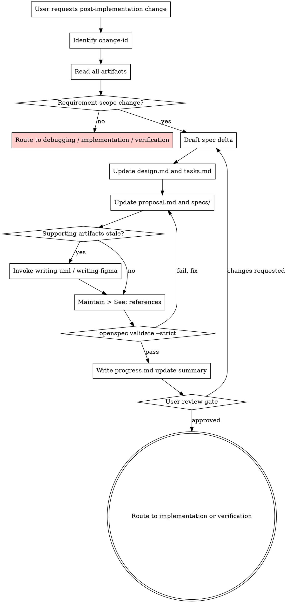

# Updating Specs After Scope Changes

Update an existing spec-driven-dev change when the user changes the requirement scope after implementation or verification has started.

<HARD-GATE>
Do NOT change implementation code before the spec update is complete and approved.

**Language:** All user-facing replies in this skill MUST use the user's input language; internal file paths, commands, and OpenSpec keywords stay in English. Reuse the language detected in the existing change artifacts or the user's message.

**Document language:** Preserve the existing artifact language. If artifacts contain `doc_language` frontmatter, use that value for all updated prose.

**Scope protection:** This skill is only for requirement-scope changes to the current spec-driven-dev change. If the request is a bug in existing behavior, invoke `spec-driven-dev:system-debugging`. If the request is a new unrelated feature, invoke `spec-driven-dev:brainstorming`.
</HARD-GATE>

## Checklist

Complete each item in order:

1. **Identify change-id** — determine the active `openspec/changes/{change-id}/` from the user's message, current branch, or existing artifacts. If multiple candidates exist, ask the user which change to update.
2. **Read all current artifacts** — `design.md`, `tasks.md`, `proposal.md`, every `specs/*/spec.md`, `diagrams/*.puml` if present, `designs/figma.md` if present, `progress.md` if present, and `verification-report.md` if present.
3. **Classify the request**:
   - **Spec update required:** new/removed requirement, changed acceptance criteria, changed user flow, changed data contract, changed state, changed integration boundary, changed visual state, or changed non-functional requirement.
   - **No spec update:** typo-only implementation fix, refactor with no behavior change, test-only correction that preserves all scenarios, or deployment/config repair with no requirement change.
   - If no spec update is required, state why and route to `spec-driven-dev:system-debugging`, `spec-driven-dev:subagent-driven-development`, `spec-driven-dev:test-driven-development`, or `spec-driven-dev:verification-before-completion` as appropriate.
4. **Draft the spec delta** — summarize what requirements/scenarios/tasks/artifacts must change. Ask for user approval before editing if the requested scope is ambiguous or broad.
5. **Update source artifacts first** — update `design.md` and `tasks.md` when the user-facing design or implementation plan changed. Keep completed task history intact; add new unchecked tasks instead of rewriting completed work away.
6. **Update OpenSpec artifacts** — update `proposal.md` impact/what-changes sections and the relevant `specs/{capability}/spec.md` Requirements or Scenarios. Use `ADDED`, `MODIFIED`, or `REMOVED` sections as appropriate.
7. **Update supporting artifacts when affected**:
   - Diagrams: invoke `spec-driven-dev:writing-uml` if a changed flow, state machine, component boundary, data relationship, or deployment shape makes existing PlantUML stale.
   - Figma: invoke `spec-driven-dev:writing-figma` if a changed UI state, copy, layout, component, or interaction makes `designs/figma.md` stale.
8. **Maintain artifact references** — every existing diagram and `designs/figma.md` must still be referenced by at least one `> See:` line from a relevant Scenario. Add or move references as needed.
9. **Run validation** — run `openspec validate {change-id} --strict`. It MUST exit 0 before this skill can complete. Fix spec errors and rerun until clean.
10. **Write update summary** — append a new section to `openspec/changes/{change-id}/progress.md` if it exists, or create it if implementation has already started. Include:
    - Scope change requested
    - Artifacts updated
    - Validation command and result
    - Next action
11. **User review gate** — say:
    > "Spec update written for `openspec/changes/{change-id}/`. Validation passed. Please review the updated spec artifacts, then tell me whether to proceed with implementation or verification."
12. **Route next step**:
    - If new implementation work is needed, ask "SDD or TDD?" and invoke `spec-driven-dev:subagent-driven-development` or `spec-driven-dev:test-driven-development`.
    - If implementation already matches the updated spec, invoke `spec-driven-dev:verification-before-completion`.

## Process Flow

## Update Rules

- Preserve completed work evidence. Do not delete `progress.md` or `verification-report.md`; append a new entry or mark the old report superseded by a new verification run.
- Keep task status honest. New scope means new unchecked task items unless the implementation already satisfies the updated scenario with evidence.
- Keep Requirements behavior-focused. Do not encode implementation details unless the requirement is explicitly about an integration, protocol, API contract, or persistence contract.
- Keep scenarios traceable. If a scenario changes, make sure downstream tests or deferred verification items can still match the scenario name.
- Do not archive. This skill updates specs only; archiving remains a user-approved action after `spec-driven-dev:verification-before-completion` fully passes.

## Self-Review

Before exiting, verify:

1. **Scope fit:** The update belongs to the current change-id and is not a separate feature.
2. **Artifact consistency:** `design.md`, `tasks.md`, `proposal.md`, specs, diagrams, and designs do not contradict each other.
3. **Reference coverage:** Existing diagrams and designs are still referenced by `> See:` lines from scenarios.
4. **Validation evidence:** `openspec validate {change-id} --strict` passed after the final edit.

## Transition Handoff

After user approval, invoke exactly one:

- `spec-driven-dev:subagent-driven-development` — when implementation work remains and the user chooses SDD.
- `spec-driven-dev:test-driven-development` — when implementation work remains and the user chooses TDD.
- `spec-driven-dev:verification-before-completion` — when the implementation already matches the updated spec and needs final verification.
