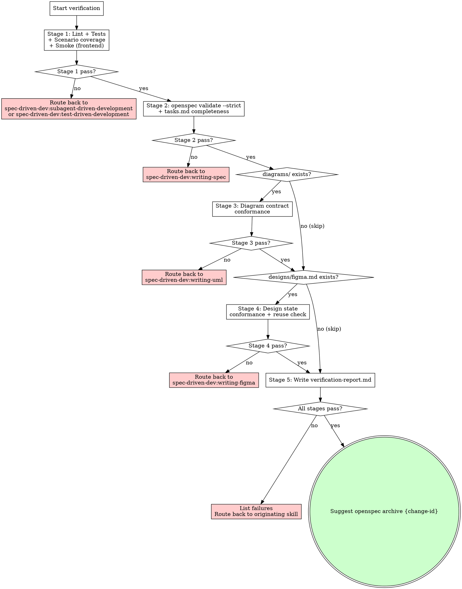

# Verification Before Completion

<HARD-GATE>
**Language:** All user-facing replies in this skill MUST use the user's input language; internal template strings (file paths, code blocks, commands) stay in English.

1. ANY stage fail → integral fail. Route back to the originating skill: code failures → `spec-driven-dev:subagent-driven-development` or `spec-driven-dev:test-driven-development`; spec failures → `spec-driven-dev:writing-spec`; diagram failures → `spec-driven-dev:writing-uml`; design failures → `spec-driven-dev:writing-figma`.
2. `verification-report.md` MUST be written to `openspec/changes/{change-id}/verification-report.md`. If the file is missing at skill exit → skill is not complete.
3. Suggest `openspec archive {change-id}` ONLY on full pass (all stages PASS or n/a).
</HARD-GATE>

**Evidence before assertions** — no success claim without captured output. If you did not run the command and see the result, you cannot claim it passes.

## Checklist

Complete all stages in order. Do not skip stages unless the conditional is satisfied.

---

### Stage 1 — Code-level verification

1. **Lint / type check** — detect project type and run the appropriate command (`npm run lint`, `tsc --noEmit`, `ruff check .`, `pylint`, etc.). Capture full stdout/stderr. MUST exit 0. Any error → Stage 1 FAIL.
2. **Unit + integration tests** — run the full test suite (e.g., `npm test`, `pytest`, `go test ./...`). Capture output verbatim. All tests MUST pass. Any failure → Stage 1 FAIL.
3. **Scenario coverage** — for each `#### Scenario: <name>` in every `openspec/changes/{change-id}/specs/{capability}/spec.md`, grep the test directory for a test whose name matches the scenario name (case-insensitive, partial match allowed). List any unmatched scenarios. If any scenario has no matching test → Stage 1 FAIL.

   ```bash
   # Replace <change-id> with the actual change ID.
   CHANGE_ID="<change-id>"
   grep -rh "^#### Scenario:" "openspec/changes/$CHANGE_ID/specs/" | \
     sed 's/^#### Scenario: *//' | while read -r scenario; do
       grep -rqi "$scenario" tests/ || echo "UNMATCHED SCENARIO: $scenario"
     done
   ```

4. **Manual smoke test** (frontend projects only — skip for pure backend/CLI) — start dev server (`npm run dev` or equivalent). Exercise the golden path and each UI state mentioned in `openspec/changes/{change-id}/tasks.md`. Capture observations as bullet points. Any broken flow → Stage 1 FAIL.

---

### Stage 2 — Spec verification

5. **`openspec validate {change-id} --strict`** — run the command. Capture output verbatim. MUST exit 0. Any error → Stage 2 FAIL.

   > **Note**: `{change-id}` is a placeholder. Substitute the actual change ID before running.

6. **tasks.md completeness** — read `openspec/changes/{change-id}/tasks.md`. Every item must either be checked off (`- [x]`) or carry an explicit `deferred:` annotation with a reason. Any unchecked item without `deferred:` → Stage 2 FAIL.

---

### Stage 3 — Diagram verification (conditional: skip if no `openspec/changes/{change-id}/diagrams/` directory)

7. **Per-diagram check** — for each `.puml` file found in `openspec/changes/{change-id}/diagrams/`, determine diagram type from the PlantUML directive and run the matching check:

   - **Sequence diagram** (`@startuml` with `->` arrows): extract message order (caller → callee, method name). Grep `src/` for function/method names in the expected call sequence order. PASS if all names found in order; FAIL if any missing; MANUAL-REVIEW if order cannot be mechanically verified.
   - **State diagram** (`state` keyword): extract states and transitions (`state A --> B`). Compare to enum values and switch/if-else state-machine logic in `src/`. PASS / FAIL / MANUAL-REVIEW.
   - **Class diagram** (`class` / `interface`): extract entity names and public methods. Compare to actual `class`, `interface`, or `type` definitions in `src/`. PASS / FAIL / MANUAL-REVIEW.
   - **ER diagram** (`entity` keyword): extract entities and relations. Compare to migration DDL files or ORM model definitions. PASS / FAIL / MANUAL-REVIEW.
   - **Activity / Use case / Component / Deployment**: mark MANUAL-REVIEW. Display the `.puml` content to the user and ask: "Does this diagram still accurately reflect the implementation? Reply go or no-go." Block until the user responds. Record the response.

   Any FAIL → Stage 3 FAIL. MANUAL-REVIEW with user no-go → Stage 3 FAIL.

---

### Stage 4 — Design verification (conditional: skip if no `openspec/changes/{change-id}/designs/figma.md`)

8. **Per-state visual check** — read `openspec/changes/{change-id}/designs/figma.md`. For each named state (happy path, empty state, error state, loading state, etc.):
   - Launch dev server or Storybook if not already running.
   - Navigate to the implementation of that state.
   - Capture a screenshot to a temp directory.
   - Place side-by-side with the Figma-referenced screenshot or node description from `figma.md`.
   - List diffs: visual layout, spacing, color tokens, copy/text, component composition.
   - Mark PASS if diffs are negligible; FAIL if any structural or copy mismatch exists.

9. **Shared component reuse check** — for each component in `figma.md` annotated `(existing)`, grep the codebase for the actual import or usage of that component. Confirm the existing component is reused, not duplicated. Any duplication → Stage 4 FAIL.

---

### Stage 5 — Aggregation

10. **Write `verification-report.md`** — write the report (using the template below) to `openspec/changes/{change-id}/verification-report.md`. This file MUST exist before the skill exits.

11. **If ALL stages pass (or n/a)** — print to the user:

    > "All verification stages passed. Suggested next step: `openspec archive {change-id}`."

12. **If ANY stage fails** — list each failed item with its stage number and route back:
    - Code fail (Stage 1) → re-invoke `spec-driven-dev:subagent-driven-development` or `spec-driven-dev:test-driven-development`
    - Spec fail (Stage 2) → re-invoke `spec-driven-dev:writing-spec`
    - Diagram fail (Stage 3) → re-invoke `spec-driven-dev:writing-uml`
    - Design fail (Stage 4) → re-invoke `spec-driven-dev:writing-figma`

---

## Process Flow



## `verification-report.md` Template

Write this file verbatim (substituting all `{...}` placeholders) to `openspec/changes/{change-id}/verification-report.md`:

````markdown
# Verification Report: {change-id}

Date: {YYYY-MM-DD}
Verifier: {model name or claude-code session id}

## Summary
- Code: {PASS | FAIL}
- Spec: {PASS | FAIL}
- Diagrams: {PASS | FAIL | n/a}
- Designs: {PASS | FAIL | n/a}

## Code Evidence
```
{Verbatim test/lint command output}
```

## Diagram Verification
| File | Type | Status | Notes |
|---|---|---|---|

## Design Verification
| State | Figma node | Status | Diff |
|---|---|---|---|

## Next Actions
- {Action items, e.g. "Fix Empty state illustration" or "All clear — suggest openspec archive"}
````

## Self-Review Four Checks

Before writing the report, confirm:

1. **Scenario coverage complete** — every `#### Scenario:` in every spec file has a matching test name. No unmatched scenarios remain.
2. **Spec valid** — `openspec validate {change-id} --strict` exited 0 with captured output attached.
3. **All diagram checks resolved** — no diagram is left in an unresolved MANUAL-REVIEW state. User go/no-go received for any activity/use-case/component/deployment diagrams.
4. **Evidence captured** — every PASS claim in the report has corresponding verbatim command output or user-confirmed observation attached. No assertion without evidence.

## Transition / Final Handoff

Verification is the **terminal skill** in the spec-driven-dev chain. There is NO next skill to invoke after this one.

- On full pass: suggest `openspec archive {change-id}` to the user. The user runs the command themselves; this skill does NOT run it.
- On any failure: route back to the originating skill as specified in Stage 5, item 12. Do not suggest `openspec archive` until a subsequent verification run achieves full pass.
