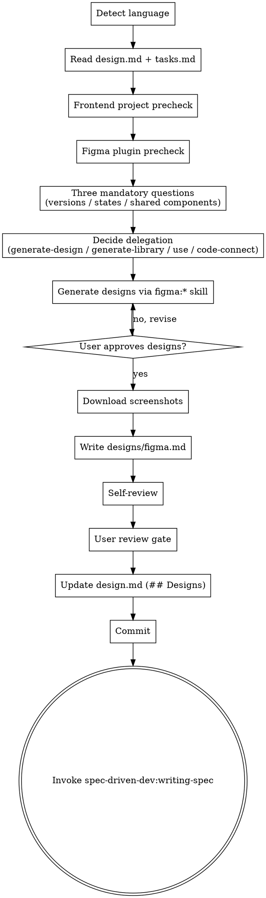

# Writing Figma Designs

Orchestrate the official figma:* skills to produce committed design assets, then hand off to writing-spec.

<HARD-GATE>
User must approve `openspec/changes/{change-id}/designs/figma.md` before invoking `spec-driven-dev:writing-spec`.

**Language policy (read carefully — most output bugs come from violating this):**

- `conversation_language` = the language of design.md's frontmatter, or the user's first message if no frontmatter is present. ALL user-facing prose (questions, prompts, transitions, abort/installation messages) MUST be rendered in this language. Do NOT hardcode or copy any user-facing phrase from this SKILL file — every example sentence here is for your understanding only, not a string to echo.
- `doc_language` = read from design.md frontmatter; defaults to `conversation_language` if absent. figma.md body prose is written in `doc_language`. The template section headings (`## Figma File`, `## Versions`, `## States`, `## Shared Components Used`, `## Acceptance Criteria`) stay in English as structural anchors; the prose values follow `doc_language`.
- Stay in one language per surface. Do not mix Chinese characters with untranslated English nouns unless that English token is a literal identifier (file path, code symbol, Figma node id, file key, plugin/slash-command name like `figma:figma-use`). When in doubt, translate.
- File paths, code blocks, Figma node IDs, plugin/slash-command names, and OpenSpec structural keywords always stay in English regardless of either language.
</HARD-GATE>

## Checklist

You MUST create a task for each of these items and complete them in order:

1. **Detect language** — set `conversation_language` from design.md frontmatter or the user's first message. Also read `doc_language` from design.md frontmatter; this controls figma.md body prose language. Lock both for the conversation.
2. **Read** `openspec/changes/{change-id}/design.md` and `openspec/changes/{change-id}/tasks.md` completely.
3. **Frontend project precheck** — check for any of these files or directories in the project root. If NONE are present, prompt the user to confirm Figma is still needed before continuing:
   - `package.json`
   - `next.config.{js,ts,mjs}`
   - `vite.config.{js,ts}`
   - `app/`
   - `pages/`
   - `src/components/`
4. **Figma plugin precheck** — verify that at least one `figma:*` skill (e.g., `figma:figma-use`, `figma:figma-generate-design`) is loaded in the current Claude session. If none is available, abort and tell the user — in `conversation_language` — to install the official figma plugin by running `/plugin marketplace add anthropics/claude-plugins` followed by `/plugin install figma`. Keep the two slash-command invocations verbatim in English; only the surrounding instructions are translated.
5. **Three mandatory questions** — ask each question in turn, in `conversation_language`. Record the answers. None may be skipped. The English wording below is illustrative — re-render each question in the active language; do not paste it as-is.
   a. **Versions**: ask whether the user needs a single variant or multiple A/B/C variants. Explain that multi-variant designs fit UX exploration and stakeholder comparison; single-variant is appropriate when the UX is already settled.
   b. **States** (multi-select — present all options; user may choose any combination):
      - Empty state
      - Loading state
      - Error state
      - Disabled / read-only state
      - Authenticated vs unauthenticated
      - Other (specify)

      Translate the option labels into `conversation_language` when presenting them.
   c. **Shared components**: ask which UI elements should be design-system primitives. For each, the user indicates `existing` (reuse from the library) or `new` (create and add to the library this change). Keep the tokens `existing` and `new` in English so this skill can pattern-match the response.
6. **Decide delegation** — based on the task type and user answers, invoke exactly one figma:* skill:
   - New screen / page / modal → invoke `figma:figma-generate-design`
   - New design system / component library → invoke `figma:figma-generate-library`
   - Edit existing Figma file / programmatic operations → invoke `figma:figma-use`
   - Code Connect component mapping → invoke `figma:figma-code-connect`
7. **Generate designs** — delegate to the chosen figma:* skill. Iterate with the user (revise → preview → approve) until designs are approved.
8. **Download screenshots** via the `mcp__plugin_figma_figma__get_screenshot` MCP tool. Save each to `openspec/changes/{change-id}/designs/screenshots/{NN}-{state}.png` (e.g., `01-happy.png`, `02-empty.png`, `03-error.png`).
9. **Write `openspec/changes/{change-id}/designs/figma.md`** using the template in the [figma.md Template](#figmamd-template) section below.
10. **Self-review** — run the four checks in the [Spec Self-Review](#spec-self-review) section. Fix inline.
11. **User review gate** — present `designs/figma.md` to the user. Tell them, in `conversation_language`, that designs/figma.md has been written to `{path}` and ask them to review the Figma URL, version coverage, state list, shared components, and acceptance criteria before choosing to proceed or request changes. Render the literal `{path}` value as-is. Wait for explicit user approval before continuing.
12. **Update `design.md`**: append a `## Designs` section linking to `./designs/figma.md`. Example:
    ```
    ## Designs
    - [Figma Designs](./designs/figma.md) — frames and acceptance criteria for {change-id}
    ```
13. **Commit**:
    ```bash
    git add openspec/changes/{change-id}/designs/ openspec/changes/{change-id}/design.md
    git commit -m "docs: add Figma designs for {change-id}"
    ```
14. **Transition**: invoke `spec-driven-dev:writing-spec`.

## Process Flow



## figma.md Template

Use this template when writing `openspec/changes/{change-id}/designs/figma.md`. The section headings (`## Figma File`, `## Versions`, `## States`, `## Shared Components Used`, `## Acceptance Criteria`) and the `State` table column header values (`Happy path`, `Empty`, `Error` as table identifiers) stay in English as structural anchors so downstream skills can grep for them. The prose values you write into placeholders (descriptions, acceptance-criteria bullets) follow `doc_language`.

````markdown
# Figma Designs: {change-id}

## Figma File
- File: https://www.figma.com/design/{fileKey}/...
- File key: {fileKey}

## Versions
- [v1] Frame node: {nodeId} — description
- [v2] Frame node: {nodeId} — description

## States
| State | Frame node | Screenshot |
|---|---|---|
| Happy path | {nodeId} | screenshots/01-happy.png |
| Empty | {nodeId} | screenshots/02-empty.png |
| Error | {nodeId} | screenshots/03-error.png |

## Shared Components Used
- `Button/Primary` (existing) — reused from design system
- `Card/Compact` (new) — added to design system this change

## Acceptance Criteria
- Implementation screens must match v1 frame {nodeId}.
- Empty / Error states must match their respective frames.
````

## Spec Self-Review

After writing `figma.md`, apply these four checks. Fix any issues inline — no re-review needed after fixing.

1. **Placeholder scan:** Any `{nodeId}`, `{fileKey}`, or `{change-id}` placeholders left unfilled? Fix.
2. **Consistency check:** Do the States table rows match the states selected in step 5b? Do screenshot filenames match files actually downloaded? Fix.
3. **Scope check:** Are all frames scoped to the current change-id? Remove anything belonging to a different change. Fix.
4. **Ambiguity check:** Could any acceptance criterion be interpreted two ways? Pick one interpretation, make it explicit. Fix.

## Transition Handoff

After the user approves `figma.md` and the commit succeeds, transition to:

- `spec-driven-dev:writing-spec` — always; this is the final artifact step before spec writing.

Invoke only the `spec-driven-dev:*` version via Skill tool. Do NOT invoke `superpowers:writing-figma` or `superpowers:writing-spec` — they are different skills with different downstream chains.
