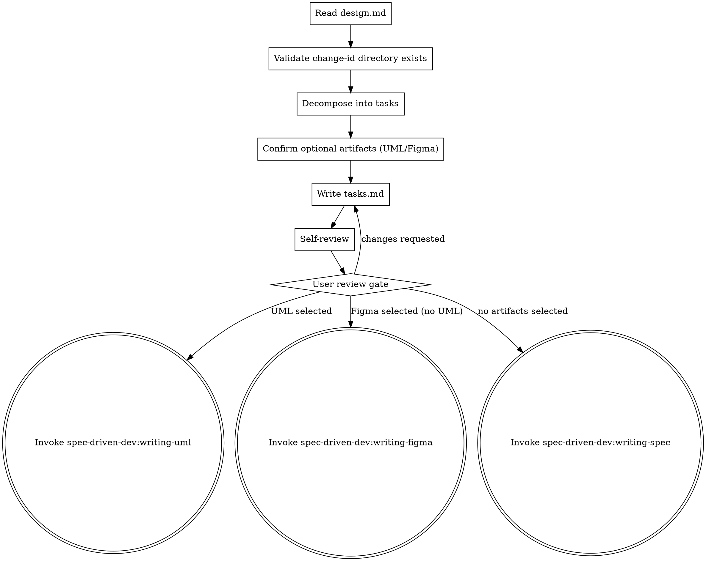

# Writing Implementation Plans

Decompose an approved design into a concrete, reviewable task checklist, then hand off to the next skill in the spec-driven-dev pipeline.

<HARD-GATE>
Do NOT invoke `spec-driven-dev:writing-uml`, `spec-driven-dev:writing-figma`, or `spec-driven-dev:writing-spec` until the user has approved tasks.md.

**Language:** All user-facing replies in this skill use the user's input language. Reuse the language detected in design.md or the first user message.
</HARD-GATE>

## Checklist

You MUST create a task for each of these items and complete them in order:

1. **Detect language** — reuse the language from design.md frontmatter, or fall back to the user's first message language. Lock for the conversation.
2. **Read `openspec/changes/{change-id}/design.md`** completely.
3. **Validate change-id and directory exist.** If not, escalate: "design.md not found — return to spec-driven-dev:brainstorming."
4. **Decompose into bite-sized tasks.** Each task entry must include:
   - Imperative title (e.g., "Add /login POST endpoint")
   - Acceptance criteria using `WHEN ... THEN ...` (and optionally `AND`) format
   - Dependencies: list any prerequisite task numbers
   - Independence estimate (note as `independent`, `serial`, or `parallel-safe` — used by downstream SDD/TDD selection)
5. **Confirm optional artifacts** with this exact multi-select prompt (verbatim, but adapt language):
   > Does this change require any of the following artifacts before implementation? (multi-select)
   > - [ ] PlantUML diagrams (spec-driven-dev:writing-uml) — fits: complex flows, state machines, cross-component interactions, ER schemas
   > - [ ] Figma designs (spec-driven-dev:writing-figma) — fits: frontend UI, interactive prototypes, A/B version comparison
6. **Write tasks.md** to `openspec/changes/{change-id}/tasks.md` using the template below. Include a `## Optional artifacts` section marking the user's selection.
7. **Spec self-review** — four checks: placeholder / consistency / scope / ambiguity. Fix inline.
8. **User review gate** — say verbatim:
   > "tasks.md written to `{path}`. Please review and tell me whether to proceed or make changes."

   Then `git add` and `git commit` the file:
   ```
   git add openspec/changes/{change-id}/tasks.md
   git commit -m "docs: add tasks for {change-id}"
   ```
9. **Transition logic:**
   ```
   if writing-uml selected → invoke spec-driven-dev:writing-uml
   elif writing-figma selected → invoke spec-driven-dev:writing-figma
   else → invoke spec-driven-dev:writing-spec
   ```

## Process Flow



## tasks.md Template

Use this template when writing `openspec/changes/{change-id}/tasks.md`:

````markdown
# Tasks: {change-id}

## 1. {Group name}
- [ ] 1.1 {Task description}
  - Acceptance: WHEN {context} THEN {expected outcome}
  - Depends on: -
  - Independence: independent | serial | parallel-safe
- [ ] 1.2 ...

## Optional artifacts
- [x] PlantUML diagrams (spec-driven-dev:writing-uml) — required types: sequence, state
- [ ] Figma designs (spec-driven-dev:writing-figma)
````

## Spec Self-Review

After writing tasks.md, apply these four checks. Fix any issues inline — no re-review needed after fixing.

1. **Placeholder scan:** Any "TBD", "TODO", incomplete acceptance criteria, or missing dependency references? Fix.
2. **Consistency check:** Do task groupings match the architecture sections in design.md? Do acceptance criteria contradict each other? Fix.
3. **Scope check:** Are tasks scoped to the current change-id? Remove anything belonging to a different change. Fix.
4. **Ambiguity check:** Could any WHEN/THEN criterion be interpreted two different ways? Pick one interpretation, make it explicit. Fix.

## Transition Handoff

After the user approves tasks.md, transition to exactly one of:

- `spec-driven-dev:writing-uml` — if PlantUML diagrams were selected
- `spec-driven-dev:writing-figma` — if Figma designs were selected (and UML was not)
- `spec-driven-dev:writing-spec` — if no optional artifacts were selected

Invoke only the `spec-driven-dev:*` versions via Skill tool. Do NOT invoke `superpowers:writing-uml`, `superpowers:writing-figma`, or `superpowers:writing-spec` — they are different skills with different downstream chains.
