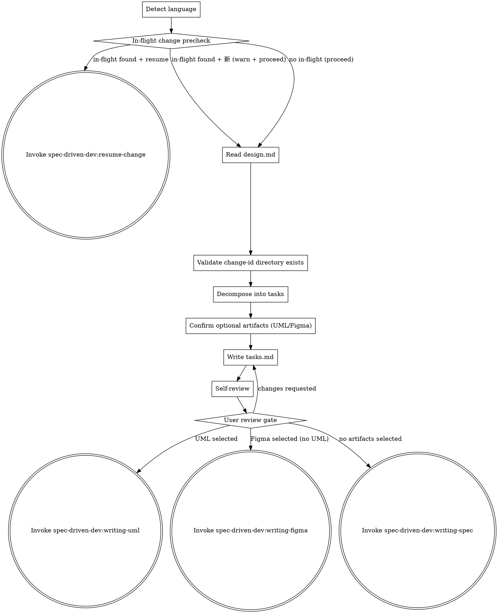

# Writing Implementation Plans

Decompose an approved design into a concrete, reviewable task checklist, then hand off to the next skill in the spec-driven-dev pipeline.

<HARD-GATE>
Do NOT invoke `spec-driven-dev:writing-uml`, `spec-driven-dev:writing-figma`, or `spec-driven-dev:writing-spec` until the user has approved tasks.md.

**Language policy (read carefully — most output bugs come from violating this):**

- `conversation_language` = the language of design.md's frontmatter, or the user's first message if no frontmatter is present. ALL user-facing prose (questions, prompts, transitions, error messages) MUST be rendered in this language. Do NOT hardcode or copy any user-facing phrase from this SKILL file — every example sentence here is for your understanding only, not a string to echo.
- `doc_language` = read from design.md frontmatter; defaults to `conversation_language` if absent. tasks.md body prose is written in `doc_language`.
- Stay in one language per surface. Do not mix Chinese characters with untranslated English nouns ("in-flight change", "resume", "task") unless that English token is a literal identifier (file path, code symbol, OpenSpec keyword like `WHEN`/`THEN`/`ADDED`, slash-command name, status enum like `in_progress`). When in doubt, translate.
- File paths, code blocks, OpenSpec structural keywords, status enums (`not_started`/`in_progress`/`passing`/`blocked`), and slash-command names always stay in English regardless of either language.
</HARD-GATE>

## Checklist

You MUST create a task for each of these items and complete them in order:

1. **Detect language** — set `conversation_language` from design.md frontmatter (or fall back to the user's first message language). Also read `doc_language` from design.md frontmatter; this controls what language to write tasks.md body prose in. Lock both for the conversation.
2. **In-flight change precheck** — scan `openspec/changes/*/` for directories that have `design.md` but no `verification-report.md` (= in-flight).
   - If no in-flight change is found (other than the one matching this skill's argument), proceed directly to step 3 — no warning, no prompt.
   - If any in-flight change OTHER than the one matching this skill's argument is found, pause before step 3 and ask the user — phrased naturally in `conversation_language` — whether they want to resume the existing in-flight change `{change-id}` or start a new one. Render the literal `{change-id}` value inline; do not translate the identifier.
     - If the user chooses to resume, invoke `spec-driven-dev:resume-change`.
     - If the user chooses to start a new change, warn (in `conversation_language`) that the in-flight change's progress is preserved but this session switches context, then proceed to step 3.
3. **Read `openspec/changes/{change-id}/design.md`** completely.
4. **Validate change-id and directory exist.** If not, escalate: "design.md not found — return to spec-driven-dev:brainstorming."
5. **Decompose into bite-sized tasks.** Each task entry must include:
   - Imperative title (e.g., "Add /login POST endpoint")
   - Acceptance criteria using `WHEN ... THEN ...` (and optionally `AND`) format
   - Dependencies: list any prerequisite task numbers
   - Independence estimate (note as `independent`, `serial`, or `parallel-safe` — used by downstream SDD/TDD selection)
6. **Confirm optional artifacts** — ask, in `conversation_language`, whether this change requires any of the following artifacts before implementation. Present as a multi-select with these two options (keep the skill identifiers verbatim because they are command names):
   - PlantUML diagrams (`spec-driven-dev:writing-uml`) — fits: complex flows, state machines, cross-component interactions, ER schemas
   - Figma designs (`spec-driven-dev:writing-figma`) — fits: frontend UI, interactive prototypes, A/B version comparison

   The English wording above is illustrative — re-render the question and the descriptions in `conversation_language`; do not paste them as-is.
7. **Write tasks.md** to `openspec/changes/{change-id}/tasks.md` using the template below. Include a `## Optional artifacts` section marking the user's selection.
8. **Spec self-review** — four checks: placeholder / consistency / scope / ambiguity. Fix inline.
9. **User review gate** — tell the user, in `conversation_language`, that tasks.md has been written to `{path}` and ask whether to proceed or make changes. Render the literal `{path}` value as-is.

   Then `git add` and `git commit` the file:
   ```
   git add openspec/changes/{change-id}/tasks.md
   git commit -m "docs: add tasks for {change-id}"
   ```
10. **Transition logic:**
    ```
    if writing-uml selected → invoke spec-driven-dev:writing-uml
    elif writing-figma selected → invoke spec-driven-dev:writing-figma
    else → invoke spec-driven-dev:writing-spec
    ```

## Process Flow



## tasks.md Template

Use this template when writing `openspec/changes/{change-id}/tasks.md`:

````markdown
# Tasks: {change-id}

## 1. {Group name}
- [ ] 1.1 {Task description}
  - Acceptance: WHEN {context} THEN {expected outcome}
  - Depends on: -
  - Independence: independent | serial | parallel-safe
  - status: not_started
- [ ] 1.2 {Task description}
  - Acceptance: WHEN {context} THEN {expected outcome}
  - Depends on: 1.1
  - Independence: serial
  - status: not_started

## Optional artifacts
- [x] PlantUML diagrams (spec-driven-dev:writing-uml) — required types: sequence, state
- [ ] Figma designs (spec-driven-dev:writing-figma)
````

### Task status state machine

Every task entry MUST carry a `- status: {state}` sub-bullet. New tasks are written with `status: not_started`; downstream skills (SDD, TDD, verification, resume) update the status on every transition.

Allowed states:

- `not_started` — task has not been picked up yet (initial state for every new task)
- `in_progress` — actively being implemented in the current session
- `passing` — implementation complete, tests / reviews green, terminal
- `blocked` — implementer paused (BLOCKED / NEEDS_CONTEXT or TDD step cannot proceed); resumable later

Allowed transitions:

- `not_started → in_progress`
- `in_progress → passing`
- `in_progress → blocked`
- `blocked → in_progress`

Forbidden transitions (any of these is a spec violation — skills MUST raise an error rather than silently rewrite):

- `not_started → passing` (work cannot skip implementation)
- `not_started → blocked` (cannot block work that has not started)
- `passing → not_started`, `passing → in_progress`, `passing → blocked` (`passing` is terminal; reopen via a new change, never by mutating status)
- `blocked → not_started` (resume via `blocked → in_progress`, never by erasing progress)
- `blocked → passing` (must re-enter `in_progress` so the unblock is recorded)
- any state → itself (no-op self-transitions are not recorded)

Single-in-progress invariant: across all tasks in a change, at most ONE task may have `status: in_progress` at any time. SDD and TDD assert this before dispatching new work; `resume` raises an error without auto-fixing when the invariant is violated.

## Spec Self-Review

After writing tasks.md, apply these four checks. Fix any issues inline — no re-review needed after fixing.

1. **Placeholder scan:** Any "TBD", "TODO", incomplete acceptance criteria, or missing dependency references? Fix.
2. **Consistency check:** Do task groupings match the architecture sections in design.md? Do acceptance criteria contradict each other? Fix.
3. **Scope check:** Are tasks scoped to the current change-id? Remove anything belonging to a different change. Fix.
4. **Ambiguity check:** Could any WHEN/THEN criterion be interpreted two different ways? Pick one interpretation, make it explicit. Fix.

## Transition Handoff

After the user approves tasks.md, transition to exactly one of:

- `spec-driven-dev:writing-uml` — if PlantUML diagrams were selected
- `spec-driven-dev:writing-figma` — if Figma designs were selected (and UML was not)
- `spec-driven-dev:writing-spec` — if no optional artifacts were selected

`spec-driven-dev:writing-uml` also covers the case when **both** UML and Figma were selected — UML runs first, and the writing-uml skill chains to writing-figma when its own transition logic detects that Figma was also selected.

Invoke only the `spec-driven-dev:*` versions via Skill tool. Do NOT invoke `superpowers:writing-uml`, `superpowers:writing-figma`, or `superpowers:writing-spec` — they are different skills with different downstream chains.
