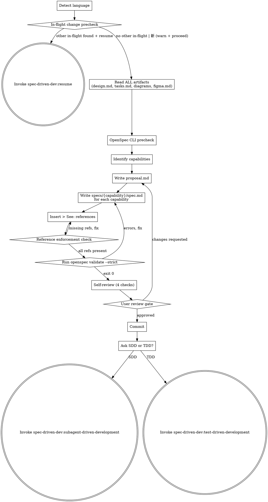

# Writing OpenSpec Change Proposals

Translate all gathered artifacts into a committed, validated OpenSpec proposal and capability specs, then hand off to the implementation skill.

<HARD-GATE>
Do NOT invoke `spec-driven-dev:subagent-driven-development` or `spec-driven-dev:test-driven-development` until the user has explicitly approved proposal.md and all specs.

**Language:** All user-facing replies in this skill MUST use the user's input language; internal template strings (file paths, code blocks, OpenSpec keywords, ADDED/MODIFIED/REMOVED/WHEN/THEN/AND/SHALL) stay in English. Reuse the language detected in design.md frontmatter or the first user message.

**Document language:** Write proposal.md and spec.md body prose in the `doc_language` value from design.md frontmatter. If no frontmatter is present, default to the detected conversation language. OpenSpec structural keywords (ADDED, MODIFIED, REMOVED, WHEN, THEN, AND, SHALL) always remain in English.

**Artifact reference enforcement:**
1. Every existing diagram in `openspec/changes/{change-id}/diagrams/*.puml` AND every existing design in `openspec/changes/{change-id}/designs/figma.md` MUST be referenced via `> See: ...` from at least one requirement Scenario.
2. `openspec validate {change-id} --strict` MUST pass (exit 0) before user review.
3. User MUST explicitly approve before invoking `spec-driven-dev:subagent-driven-development` or `spec-driven-dev:test-driven-development`.
</HARD-GATE>

## Checklist

You MUST complete each item in order:

1. **Detect language** — reuse the conversation language from design.md frontmatter or the user's first message. Also read `doc_language` from design.md frontmatter; this controls the prose language for proposal.md and spec.md body content. Lock both for the conversation.
1.5. **In-flight change precheck** — scan `openspec/changes/*/` for directories that have `design.md` but no `verification-report.md` (= in-flight).
   - If no in-flight change is found (other than the one matching this skill's argument), proceed directly to step 2.
   - If any in-flight change OTHER than the one matching this skill's argument is found, pause before step 2 and prompt the user verbatim: "偵測到 in-flight change `{change-id}`，要 resume 還是開新？".
     - On "resume" invoke `spec-driven-dev:resume`.
     - On "新" emit a warning that the in-flight change's progress is preserved but this session switches context, then proceed to step 2.
2. **Read ALL artifacts** in `openspec/changes/{change-id}/`: `design.md`, `tasks.md`, `diagrams/*.puml` (if any), `designs/figma.md` (if it exists). Do not skip any file present.
3. **OpenSpec CLI precheck** — run `command -v openspec` and `test -d openspec/`. If either check fails, abort with:
   > Install: `npm i -g @fission-ai/openspec`
   > Initialize: `openspec init` from repo root
4. **Identify capabilities** from design.md. A capability is a cohesive functional domain (e.g., `auth`, `payment`, `notifications`). If the capability boundaries are not obvious, default to one capability named `{change-id}-cap`.
5. **Write `proposal.md`** using the template below. The `## Related Artifacts` section must link ALL existing diagrams and designs found in step 2. Write it to `openspec/changes/{change-id}/proposal.md`.
6. **For each capability, write `specs/{capability}/spec.md`** using the template below. Use `## ADDED Requirements`, `## MODIFIED Requirements`, or `## REMOVED Requirements` as appropriate. Each Requirement must have at least one `#### Scenario:` block with `WHEN` / `THEN` / optional `AND` lines.
7. **Insert `> See:` references** inside the relevant Scenarios. Reference paths must be relative to the spec file (e.g., `> See: ../../diagrams/01-sequence-login-flow.puml`). Every diagram and design file found in step 2 must appear in at least one `> See:` line across all spec files.
8. **Run reference enforcement check** — verify every artifact is referenced:

   > **Note**: throughout this skill, `{change-id}` is a placeholder for the actual change ID (e.g., `add-user-auth`). Substitute it before running any command.

   Substitute the actual change ID (e.g., `add-user-auth`) for `<actual-change-id>` before running.
   ```bash
   # Replace <actual-change-id> with the change ID for the current task.
   CHANGE_ID="<actual-change-id>"
   artifacts_array=()
   while IFS= read -r f; do
       [ -n "$f" ] && artifacts_array+=("$f")
   done < <(find "openspec/changes/$CHANGE_ID/diagrams" -name "*.puml" 2>/dev/null)
   [ -f "openspec/changes/$CHANGE_ID/designs/figma.md" ] && artifacts_array+=("openspec/changes/$CHANGE_ID/designs/figma.md")
   references=$(grep -rE "^> See:" "openspec/changes/$CHANGE_ID/specs/" 2>/dev/null)
   for a in "${artifacts_array[@]}"; do
       name=$(basename "$a")
       echo "$references" | grep -q "$name" || { echo "ERROR: unreferenced artifact: $a"; exit 1; }
   done
   ```
   Fix any missing references before continuing.
9. **Run `openspec validate {change-id} --strict`** — must exit 0. Fix any reported errors (see `./openspec-format.md` for common errors and fixes) and re-run until clean.
10. **Self-review four checks** (see [Spec Self-Review](#spec-self-review) section). Confirm every diagram and design is referenced from at least one Scenario. Fix inline.
11. **User review gate** — say verbatim:
    > "proposal.md and specs/ written to `openspec/changes/{change-id}/`. Validation passed. All diagrams and designs are referenced from at least one Scenario. Please review the proposal and specs, then tell me whether to proceed with SDD or TDD."

    Then commit:
    ```bash
    git add openspec/changes/{change-id}/
    git commit -m "docs: add OpenSpec proposal and specs for {change-id}"
    ```
12. **Transition** — ask the user "SDD or TDD?" then invoke exactly one:
    - `spec-driven-dev:subagent-driven-development` — if the user chooses SDD (parallel, independent tasks)
    - `spec-driven-dev:test-driven-development` — if the user chooses TDD (red-green-refactor cycle)

## Process Flow



## proposal.md Template

Use this template when writing `openspec/changes/{change-id}/proposal.md`:

````markdown
## Why
{Motivation; current pain points}

## What Changes
- **{capability}**: {summary of change}
- ...

## Impact
- Affected specs: `specs/{capability}/`
- Affected code: {directory or file scope}
- Breaking changes: {Yes/No + detail}

## Related Artifacts
### Design
- [design.md](./design.md)
- [tasks.md](./tasks.md)

### Diagrams
- [Sequence: Login Flow](./diagrams/01-sequence-login-flow.puml)

### Figma Designs
- [Figma reference](./designs/figma.md)
````

## specs/{capability}/spec.md Template

Use this template when writing `openspec/changes/{change-id}/specs/{capability}/spec.md`:

````markdown
## ADDED Requirements

### Requirement: User shall be able to log in with email + password
The system SHALL authenticate users via email and password credentials.

#### Scenario: Successful login
- **WHEN** a user submits valid email and password
- **THEN** the system returns a session token
- **AND** redirects to the dashboard

> See: ../../diagrams/01-sequence-login-flow.puml
> See: ../../designs/figma.md#happy-path

#### Scenario: Invalid credentials
- **WHEN** a user submits invalid credentials
- **THEN** the system returns 401 with an error message
- **AND** does not create a session

> See: ../../designs/figma.md#error-state
````

For full OpenSpec syntax details — delta types, scenario format, `> See:` conventions, and `openspec validate` errors — see `./openspec-format.md`.

## Spec Self-Review

After writing all files, apply these four checks. Fix any issues inline — no re-review needed after fixing.

1. **Placeholder scan:** Any `{change-id}`, `{capability}`, or incomplete Scenario lines? Fix all.
2. **Consistency check:** Do capability names match those in design.md? Do Scenario outcomes contradict tasks.md acceptance criteria? Fix.
3. **Scope check:** Are all Requirements scoped to the current change-id? Remove anything belonging to a different change. Fix.
4. **Ambiguity check:** Could any WHEN/THEN criterion be interpreted two ways? Pick one interpretation, make it explicit. Fix.

## Transition Handoff

After the user approves and the commit succeeds, transition to exactly one of:

- `spec-driven-dev:subagent-driven-development` — if the user chooses SDD (tasks are independent and can be dispatched in parallel)
- `spec-driven-dev:test-driven-development` — if the user chooses TDD (test-first, red-green-refactor cycle)

Invoke only the `spec-driven-dev:*` versions via Skill tool. Do NOT invoke `superpowers:subagent-driven-development` or `superpowers:test-driven-development` — they are different skills with different downstream chains and do not share the OpenSpec context built in this pipeline.
