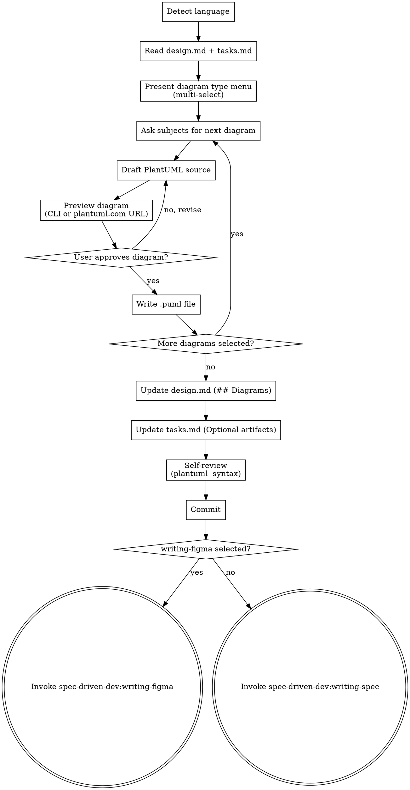

# Writing UML Diagrams with PlantUML

Translate selected diagram types into committed PlantUML sources, then hand off to writing-figma or writing-spec.

<HARD-GATE>
Do NOT invoke `spec-driven-dev:writing-figma` or `spec-driven-dev:writing-spec` until all selected diagrams are user-approved and committed.

**Language:** All user-facing replies in this skill MUST use the user's input language; internal template strings (file paths, code blocks, PlantUML source) stay in English. Reuse the language detected in design.md frontmatter or the first user message.
</HARD-GATE>

## Checklist

You MUST create a task for each of these items and complete them in order:

1. **Detect language** — reuse from design.md frontmatter or the user's first message. Lock for the conversation.
2. **Read** `openspec/changes/{change-id}/design.md` and `openspec/changes/{change-id}/tasks.md` completely. Note which diagram types tasks.md marks as required.
3. **Present the diagram type menu** as a multi-select prompt. For each type, describe what it represents and list 2-3 typical use cases. Use the table in the [Diagram Type Menu](#diagram-type-menu) section below. Full PlantUML syntax examples are in `./diagram-types.md`.
4. **For each selected diagram type**, in order:
   1. Ask the user what subjects the diagram should cover (actors, classes, states, services, entities, etc.).
   2. Draft the PlantUML source.
   3. Preview the diagram using this detection logic:
      ```bash
      if command -v plantuml >/dev/null 2>&1; then
          plantuml -tpng openspec/changes/{change-id}/diagrams/{filename}.puml
          # User opens the resulting PNG locally
      else
          # Generate a plantuml.com URL by base64-encoding the source per their API
          # Prompt user to open the URL in browser
          # See https://plantuml.com/text-encoding for the encoding algorithm
      fi
      ```
   4. Iterate with the user until the diagram is approved.
   5. Write the approved source to `openspec/changes/{change-id}/diagrams/{seq-no}-{type}-{topic}.puml` where:
      - `seq-no`: zero-padded two-digit (01, 02, ...)
      - `type`: lowercase kebab-case diagram type (sequence, class, use-case, activity, state, component, er, deployment)
      - `topic`: lowercase kebab-case noun phrase (e.g., login-flow, order-lifecycle)
5. **Update `design.md`**: append a `## Diagrams` section listing each diagram as a markdown link with its relative path. For example:
   ```
   ## Diagrams
   - [Sequence: Login Flow](./diagrams/01-sequence-login-flow.puml) — describes how the user logs in via OAuth
   - [State: Session Lifecycle](./diagrams/02-state-session-lifecycle.puml) — shows session state transitions
   ```
6. **Update `tasks.md`**: in the `## Optional artifacts` section, replace the PlantUML checkbox item with a nested list of produced diagrams. For example:
   ```
   - [x] PlantUML diagrams:
     - [01-sequence-login-flow.puml](./diagrams/01-sequence-login-flow.puml)
     - [02-state-session-lifecycle.puml](./diagrams/02-state-session-lifecycle.puml)
   ```
7. **Self-review**: for each `.puml` file, run `plantuml -syntax {file}.puml` if plantuml is available — verify each parses without error. Confirm all diagrams are referenced in design.md.
8. **Commit**:
   ```bash
   git add openspec/changes/{change-id}/diagrams/*.puml openspec/changes/{change-id}/design.md openspec/changes/{change-id}/tasks.md
   git commit -m "docs: add PlantUML diagrams for {change-id}"
   ```
9. **Transition logic**:
   ```
   if tasks.md still marks writing-figma → invoke spec-driven-dev:writing-figma
   else → invoke spec-driven-dev:writing-spec
   ```

## Process Flow



## Diagram Type Menu

Present this as a multi-select prompt. Each row describes what the diagram represents and lists typical use cases.

| # | Diagram Type | Used for |
|---|---|---|
| 1 | Sequence Diagram | Object / service message exchange over time. API flows, cross-service calls, authentication handshakes. |
| 2 | Class Diagram | Type structure and relationships. Domain models, inheritance, dependencies. |
| 3 | Use Case Diagram | System capabilities exposed to external actors. Clarifying user intent and system boundaries. |
| 4 | Activity Diagram | Business flows and decision branches. Flowcharts; supports parallelism (fork/join). |
| 5 | State Diagram | Object lifecycle and state transitions. Order states, session states, workflows. |
| 6 | Component Diagram | High-level architecture: components and their interfaces. System zoom-out view. |
| 7 | ER Diagram | Database entities and relationships. Schema design, foreign keys. |
| 8 | Deployment Diagram | Physical / cloud deployment topology. Cross-env, containers, cloud services. |

## File Naming Rule

> **Naming convention:** `{seq-no}-{type}-{topic}.puml`
>
> Example: `01-sequence-login-flow.puml`
>
> - `seq-no`: zero-padded two-digit counter, starting at `01`
> - `type`: lowercase kebab-case type name (sequence, class, use-case, activity, state, component, er, deployment)
> - `topic`: lowercase kebab-case noun phrase describing the subject

## Preview Detection

1. **Local CLI (preferred):** Check `command -v plantuml`. If found, run `plantuml -tpng {file}.puml`. The user opens the resulting PNG from the local filesystem.
2. **plantuml.com fallback:** If plantuml is not installed, encode the `.puml` source using PlantUML's text encoding algorithm (deflate + custom base64 alphabet — see https://plantuml.com/text-encoding for the exact algorithm). Then construct a URL of the form `https://www.plantuml.com/plantuml/png/{encoded}` and prompt the user to open it in a browser.

## Syntax Reference

Full PlantUML syntax examples for all eight diagram types are in `./diagram-types.md`. Consult it when drafting any diagram.

## Transition Handoff

After all diagrams are committed, transition to exactly one of:

- `spec-driven-dev:writing-figma` — if tasks.md still marks Figma designs as required
- `spec-driven-dev:writing-spec` — otherwise

Invoke only the `spec-driven-dev:*` versions via Skill tool. Do NOT invoke `superpowers:writing-figma` or `superpowers:writing-spec` — they are different skills with different downstream chains.
