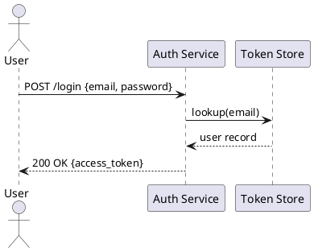
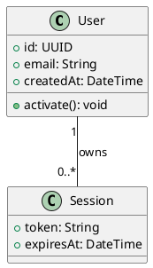
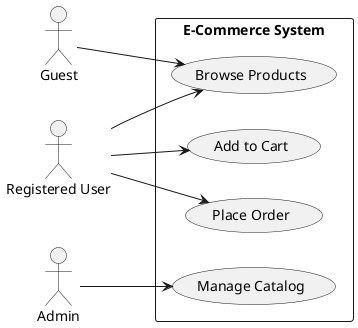
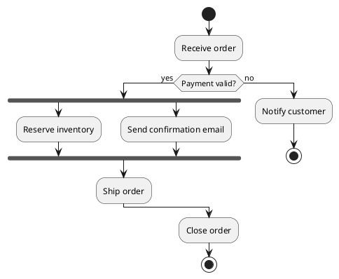
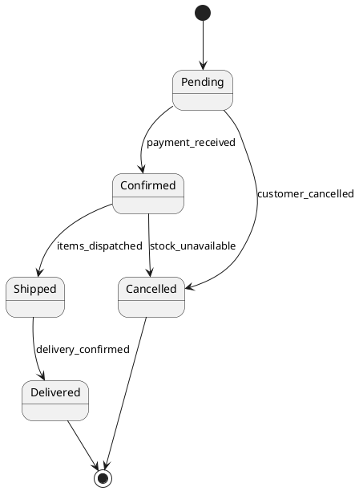
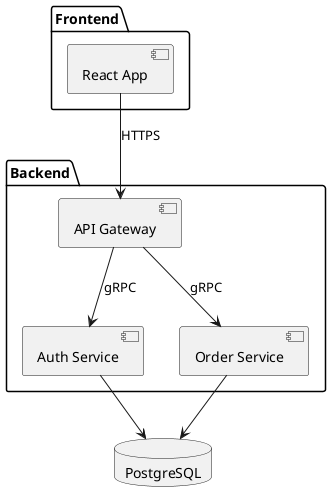
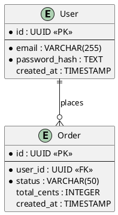
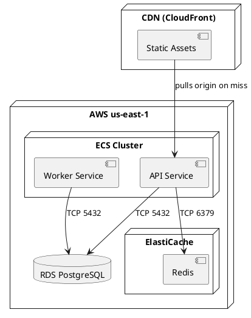

# PlantUML Diagram Types — Syntax Cheat Sheet

Reference for the `spec-driven-dev:writing-uml` skill. Each section contains a purpose statement, guidance on when to use the diagram, a minimal working example, and a common pitfall.

---

## Sequence

**Purpose:** Shows message exchange between objects or services over time, making call order and response paths explicit.

**Fits when:**
- Documenting an API flow (e.g., login, checkout, OAuth handshake)
- Illustrating cross-service calls in a microservice architecture
- Clarifying async operations such as webhooks or event-driven flows

**Minimal example:**

**Common pitfall:** Forgetting to use `->>` (or `-->`) for asynchronous messages distinct from synchronous `->`. In async API flows (events, message queues), using sync arrows misleads readers about ordering guarantees.

---

## Class

**Purpose:** Depicts type structure, attributes, methods, and relationships (inheritance, composition, association) between classes.

**Fits when:**
- Designing or documenting a domain model
- Showing inheritance hierarchies and interface implementations
- Mapping dependencies between modules or services

**Minimal example:**

**Common pitfall:** Avoid putting every method and field into a class diagram — show only what is relevant to the design decision at hand, or the diagram becomes unreadable.

---

## Use Case

**Purpose:** Illustrates system capabilities as use cases exposed to external actors, clarifying what the system does and who interacts with it.

**Fits when:**
- Establishing system boundaries at the start of a project
- Communicating scope to non-technical stakeholders
- Identifying which actors trigger which features

**Minimal example:**

**Common pitfall:** Do not model every UI action as a separate use case — group related steps into a single use case that represents a user goal.

---

## Activity

**Purpose:** Describes business process flows and decision branches, supporting parallelism via fork and join notation.

**Fits when:**
- Modeling a multi-step business workflow (order fulfilment, onboarding)
- Representing a decision tree or branching logic
- Documenting concurrent or parallel processing paths

**Minimal example:**

**Common pitfall:** Deeply nested `if/else` blocks become unreadable — flatten decision logic by using guard labels on arrows or splitting into sub-diagrams.

---

## State

**Purpose:** Captures the lifecycle of an object: every state it can be in and the events or conditions that trigger transitions.

**Fits when:**
- Modeling an entity with a clear lifecycle (order, subscription, ticket)
- Documenting a session or authentication state machine
- Identifying which transitions are valid and which are forbidden

**Minimal example:**

**Common pitfall:** Always include terminal states (`[*]`) and label every transition with the triggering event — unlabelled arrows leave ambiguity about what causes the transition.

---

## Component

**Purpose:** Shows the high-level architecture of a system: components (modules, services, libraries) and the interfaces through which they communicate.

**Fits when:**
- Zooming out to show how major parts of the system relate
- Documenting interface contracts between teams or services
- Planning integration points before implementation

**Minimal example:**

**Common pitfall:** Keep components at the same level of abstraction — mixing a microservice and an individual class in the same diagram creates a misleading architecture picture.

---

## ER

**Purpose:** Models database entities, their attributes, and the relationships (cardinality, foreign keys) between them.

**Fits when:**
- Designing a relational schema before writing migrations
- Communicating data model decisions to the team
- Identifying foreign key dependencies and join paths

**Minimal example:**

**Common pitfall:** Use `<<PK>>` and `<<FK>>` stereotypes explicitly — omitting them makes it unclear which fields are keys, defeating the purpose of the diagram.

---

## Deployment

**Purpose:** Depicts the physical or cloud deployment topology: how artefacts are assigned to nodes, containers, and environments.

**Fits when:**
- Documenting a production environment (cloud regions, VMs, containers)
- Planning cross-environment flows (dev → staging → prod)
- Illustrating container orchestration and service mesh topology

**Minimal example:**

**Common pitfall:** Do not conflate logical services with physical nodes — a single EC2 instance running multiple containers should show the containers nested inside the node, not as separate top-level nodes.
